# Apstra Test Drive

## Hands-on with Juniper Networks' Data Centre Automation Solution

## Welcome to Your Apstra Test Drive!

Thank you for joining us for this hands-on experience with Juniper Apstra, the industry's only Intent-Based Networking solution for data centre operations. Over the next two hours, you'll get direct experience with how Apstra can transform your data centre operations - from initial design to ongoing management and optimisation.

## What is Apstra?

Apstra is a powerful intent-based networking solution that enables you to design, build, deploy, and operate your data centre network with confidence and agility. Unlike traditional data centre network management approaches, Apstra provides:

* **Intent-Based Architecture**: Define what you want your network to do, not how to do it
* **Single Source of Truth**: One unified view of your entire network state
* **Closed-Loop Validation**: Continuous verification that your network meets your intent
* **Multi-Vendor Support**: Freedom to choose the best hardware for your needs
* **Automation Throughout the Lifecycle**: From design to deployment to operation

## What You'll Learn Today

This Test Drive is designed to give you practical experience with Apstra's key capabilities in a realistic data centre environment. We've divided the session into two main sections:

### Part 1: Design & Blueprint (30 minutes)

Learn how Apstra lets you model your entire data centre in software before deploying any physical equipment:

* Understanding logical devices, interface maps, and device profiles
* Creating rack types to model your physical infrastructure
* Building templates to define your network architecture
* Deploying a blueprint and assigning resources

### Part 2: Day 2 Operations (90 minutes)

Experience how Apstra simplifies ongoing management of your data centre network:

* Exploring the dashboard and understanding fabric health
* Scaling your data centre by adding new racks
* Extending connectivity with new virtual networks
* Adding and connecting new servers to your fabric
* Setting up external BGP peerings
* Using Time Voyager to roll back configuration changes
* Leveraging analytics to monitor and troubleshoot your network
* Creating custom analytics probes for your specific needs

## Getting Started

Your lab environment is already configured and waiting for you. All the necessary components are accessible through the CloudLabs portal you've logged into.

Let's begin by exploring how Apstra allows you to design your data centre network completely in software, before you ever connect a single cable!

---

## How Apstra Manages Devices

As you progress through the lab, you'll work with abstractions that represent common network constructs. This Intent-Based Networking approach uses these abstractions to build your design, giving Apstra the power to reliably deploy and modify complex infrastructures with speed and precision.

For this Test Drive, we've pre-configured the Logical Devices and Interface Maps to streamline the experience, but you'll become familiar with how these components work together in the upcoming exercises.

**Ready to start? Let's dive in!**

> **TIP**  
> If this is your first time using the CloudLabs environment, navigate to Home Page and view the *Getting Started* instructions.

---

Before we begin building our network, it's essential to understand the foundational elements that make Apstra's intent-based approach possible. These building blocks enable a revolutionary approach to network design -- the ability to model your entire data centre network in software before deploying any physical hardware.

## How Apstra Models Network Hardware

The diagram below illustrates the three key components Apstra uses to model network devices:

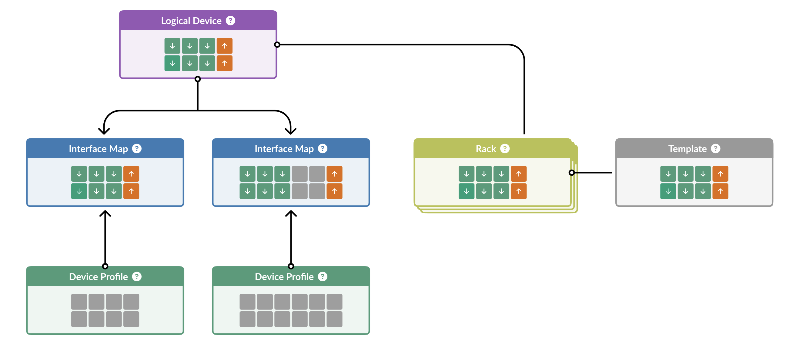

Let's explore each of these components and how they work together to create Apstra's powerful abstraction layer:

## Logical Devices

**What they are:** Complete abstractions that define the capabilities of a network device, independent of any physical hardware. They specify:

* Number of ports
* Port speeds
* Breakout capabilities

**Key insight:** A single Logical Device can represent switches from multiple vendors. For example, a "48x10G + 6x100G" Logical Device could represent similar switches from Juniper, Cisco, Arista, or any other vendor. Most vendors offer switches with nearly identical port configurations, making this abstraction extremely powerful.

Think of Logical Devices as the **functional blueprint** of what a switch can do, completely separated from the details of who manufactured it or how it's physically constructed.

## Device Profiles

**What they are:** Pre-defined, thoroughly tested representations of specific hardware platforms that are shipped with Apstra.

**What they contain:**

* Technical specifications for each supported physical or virtual device
* Vendor-specific details needed to configure and monitor the device
* Software compatibility information

Device Profiles are created and maintained by Apstra engineering, ensuring that each supported platform works seamlessly with the system. They contain all the vendor-specific knowledge that Apstra needs to properly manage each physical device.

Think of Device Profiles as the **vendor-specific knowledge base** that allows Apstra to properly manage different hardware platforms.

## Interface Maps

**What they are:** The critical "glue" that connects abstract Logical Devices to physical hardware when you're ready to deploy.

**How they work:**

* Map the abstract ports defined in a Logical Device to the actual physical interfaces on a specific switch
* Enable the transition from design (software) to deployment (hardware)
* Activated when you add a device to a blueprint and commit configuration

Think of Interface Maps as the **translation layer** that connects your abstract design to the physical reality of your data centre.

## Why This Abstraction Is Revolutionary

This abstraction layer is the foundational principle that enables Apstra's most powerful capabilities:

1. **Design Without Hardware:** Model your entire data centre network in software without owning a single physical switch
2. **True Multi-Vendor Support:** Mix and match hardware from different vendors in the same blueprint
3. **Vendor Independence:** Change hardware vendors without changing your network design
4. **Future-Proofing:** Swap in new hardware generations while maintaining the same logical design
5. **Focus on Intent:** Design based on what you need your network to do, not vendor-specific implementation details

The beauty of this approach is that you can design your entire network based on capabilities and intent, then decide which specific hardware to deploy later. You can even change vendors for different parts of your network, or replace hardware with a different vendor's equipment later, all while maintaining the same logical design.

For this Test Drive, these components have been pre-configured for you to save time. As you continue to explore Apstra, you'll gain a deeper appreciation for how this abstraction layer simplifies network design, deployment, and management.

**Now that we understand these foundational elements, let's move on to creating Rack Types that will form the physical structure of our data centre design.**

Rack Types are modular definitions that represent the physical structure of your data centre racks, including:

* Top-of-rack switches
* Servers and workloads
* Connections between devices
* Redundancy settings

Think of Rack Types as the building blocks you'll use to assemble your complete data centre design. By creating reusable Rack Types, you can quickly scale your network design by adding new instances of the same rack configuration.

In this exercise, we'll create two common rack configurations:

1. A single-switch rack (single leaf)
2. A dual-switch rack with redundant connectivity (dual leaf)

## Exercise 1: Create Single Leaf Rack Type

Let's create a simple rack with a single top-of-rack switch and one connected server:

1. Navigate to Design > Rack Types and click **Create in Designer**

   

2. In the **Summary** section, configure:

   | Summary | Value |
   |---------|-------|
   | Name | *your_name*-single |
   | Fabric connectivity design | L3 Clos |

3. Add a leaf switch by clicking the leaf icon in the bottom menu. With the node selected, click the wrench icon to configure:

   | Leafs | Values |
   |-------|--------|
   | Name | *your_name*-single |
   | Logical Device | slicer-7x10-1 |
   | Links per spine | 1 |

   

4. Add a server by clicking the **Add Generic** icon in the menu. After it appears, configure it with the wrench icon:

   | Server | Values |
   |--------|--------|
   | Name | single-server |
   | Logical Device | AOS-1x10-1 |

   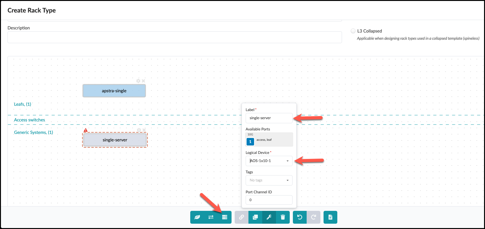

5. Connect the devices by:
   - Click and drag to select both the switch and server
   - Click the chain icon to create a link between them
   - Set Count to 1
   - Click Create

   

6. In the next view, you can optionally modify the link label, then click Create

   

7. Your completed rack should look like this:

   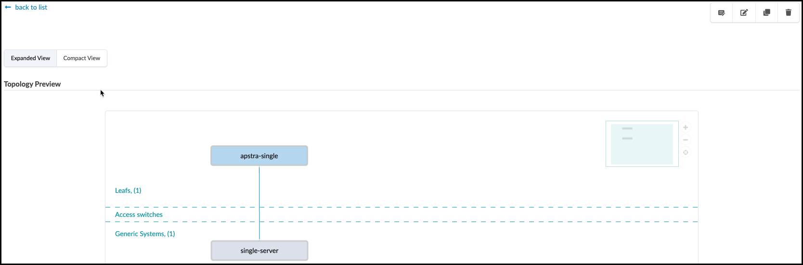

## Exercise 2: Create Dual-Homed Rack Type

Now let's create a more complex rack with redundant switches for high availability:

1. From Design > Rack Types, click **Create in Designer**
2. Configure the rack summary:

   | Summary | Value |
   |---------|-------|
   | Name | *your_name*-esi |
   | Fabric connectivity design | L3 Clos |

3. Add a leaf node and configure it:

   | Leafs | Value |
   |-------|-------|
   | Label | *your_name*-esi |
   | Logical Device | slicer-7x10-1 |
   | Links per spine | 1 |
   | Redundancy Protocol | esi |

   

   *Notice how selecting "esi" automatically adds a second leaf switch to your design!*

4. Add a dual-connected server:

   | Parameter | Values |
   |-----------|--------|
   | Label | dual-server |
   | Logical Device | AOS-2x10-1 |

   

5. Create connections by selecting both leaf switches and the server, then:
   - Ensure both "First" and "Second" peer switches are checked
   - Click Create

   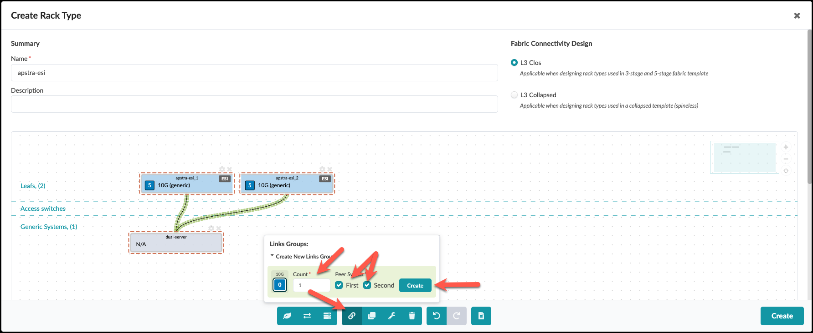

6. In the next screen, set LAG Mode to "LACP Active" and click Create

   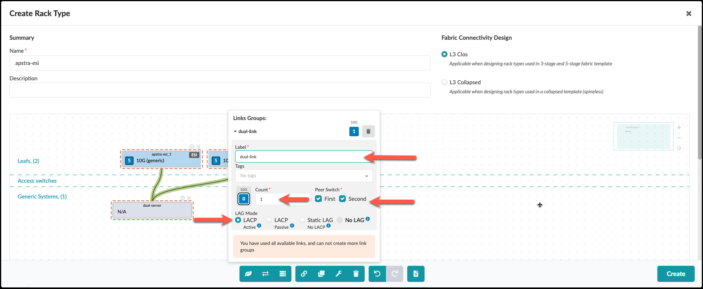

7. Your completed dual-switch rack should look like this:

   

Congratulations! You've created two rack types that can be used as building blocks for your data centre fabric design. In the next section, we'll use these rack types to create a complete network template.

> **TIP**  
> **Pro Tip:** Rack Types are extremely flexible - you can design them to match exactly how your physical racks are configured, with different server types, connection patterns, and redundancy options. For large data centres, well-designed Rack Types dramatically simplify the network design process.

---

Templates are where we bring together the rack types we've built and define how they connect to form a complete data centre fabric. Think of templates as the architectural blueprint for your network design.

A template allows you to:

* Specify how many of each rack type you'll deploy
* Define spine switches to connect your racks
* Configure global networking policies
* Set the foundation for routing and switching protocols

Let's create a template that uses both rack types we built in the previous exercise.

## Exercise: Create a Fabric Template

1. Navigate to Design > Templates and click **Create Template**

   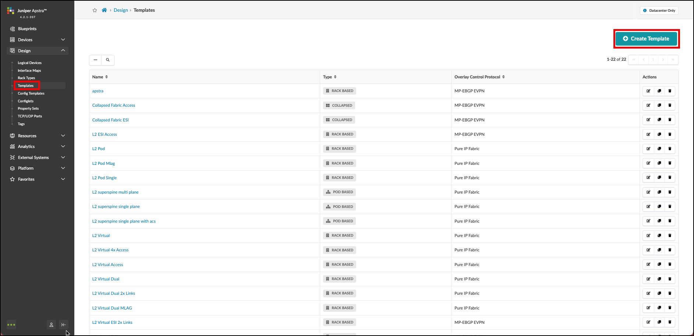

2. In the **Common Parameters** section, configure:

   | Common Parameters | Value |
   |------------------|-------|
   | Name | __your_name___fabric |
   | Type | RACK BASED |

3. In the **Policies** section, configure:

   | Policies | Value |
   |----------|-------|
   | ASN Allocation Scheme (spine) | Unique |
   | Overlay Control Protocol | MP-EBGP EVPN |

   These settings define:
   - How ASNs (Autonomous System Numbers) will be assigned to spine switches
   - That MP-EBGP EVPN will be used as the overlay protocol for virtual networks

4. In the **Structure** section, build your fabric topology:

   | Structure | Value |
   |-----------|-------|
   | Rack Types | *your_name*-esi (1x10 Gbps links to spines) |
   | Number of Racks | 1 |
   | Click **Add racks** |  |
   | Rack Types | *your_name*-single (1x10 Gbps links to spines) |
   | Number of Racks | 1 |
   | Spine Logical Device | slicer-7x10-1 |
   | (Spine) Count | 2 |
   | Links per Superspine Count | *leave as is* |
   | Link to Superspine Speed | *leave as is* |

   As you add these elements, notice how the topology preview on the right updates to visualise your fabric design.

5. Click **Create** to generate your template.
6. To view the details of your template, click its name in the template list. Check the **Show Links?** box to see the connections between devices.

   

   This diagram shows:
   - Your dual-leaf rack (ESI) and single-leaf rack
   - Two spine switches
   - All interconnections between leafs and spines
   - Device roles within the fabric

## Understanding Your Template

Let's take a moment to understand what you've created:

* A **2-tier Clos fabric** (spine-leaf architecture)
* Two **spine switches** providing redundant connections between all leafs
* One **dual-switch rack** with ESI (Ethernet Segment Identifier) for high availability
* One **single-switch rack** for lower-cost deployment
* **MP-EBGP EVPN** as the overlay protocol for network virtualisation

This design provides:

* **High availability** through redundant paths
* **Scalability** - you can add more racks without redesigning the network
* **Flexibility** - different rack types for different needs
* **Standardisation** - consistent configuration across all devices

## Next Steps

You've now created a complete software model of your network design! In the next exercise, we'll instantiate this template as a blueprint - which is a deployable instance of your design - and assign resources to make it ready for deployment.

> **TIP**  
> **Pro Tip:** Templates are reusable - you can create multiple blueprints from the same template. This makes it easy to deploy consistent network designs across multiple environments or data centres.

---

A Blueprint is a deployable instance of your template. While a template is the general design for your network, a blueprint is the specific implementation that will be deployed to your actual devices.

In this exercise, we'll:

1. Create a blueprint from the template we just built
2. Assign all necessary network resources (ASNs and IP pools)
3. Save our work with our first blueprint commit

## Exercise 1: Create a Blueprint

1. Click **Blueprints**, then click **Create Blueprint**

   

2. Configure your blueprint:

   | Field | Value |
   |-------|-------|
   | Name | *your_name*-pod1 |
   | Template | __your_name___fabric |

3. A preview of the blueprint's intent will appear. Review it and click **Create**
4. For a moment, you'll see Apstra "scaffolding" the blueprint - creating all the necessary components from your template
5. Once complete, click the blueprint name to see its dashboard

   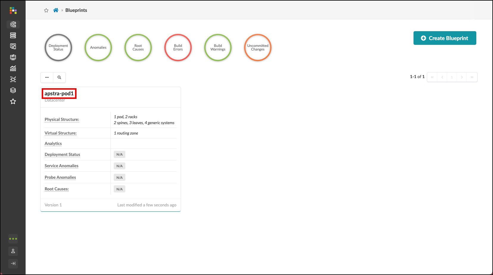

## Exercise 2: Assign Resources

You'll notice red indicators showing where resource assignments are needed. These are places where specific values (like IP addresses or ASNs) need to be assigned before the blueprint can be deployed. Let's assign all the necessary resources to our blueprint.

> **NOTE**: The specific pools we're using in this exercise are pre-configured examples. In your production environment, you can use any non-overlapping address ranges. Apstra will always validate that no IP address or ASN overlaps exist in the fabric.

### Assign ASN Resources

1. From the blueprint, navigate to Staged > Physical > Build > Resources

   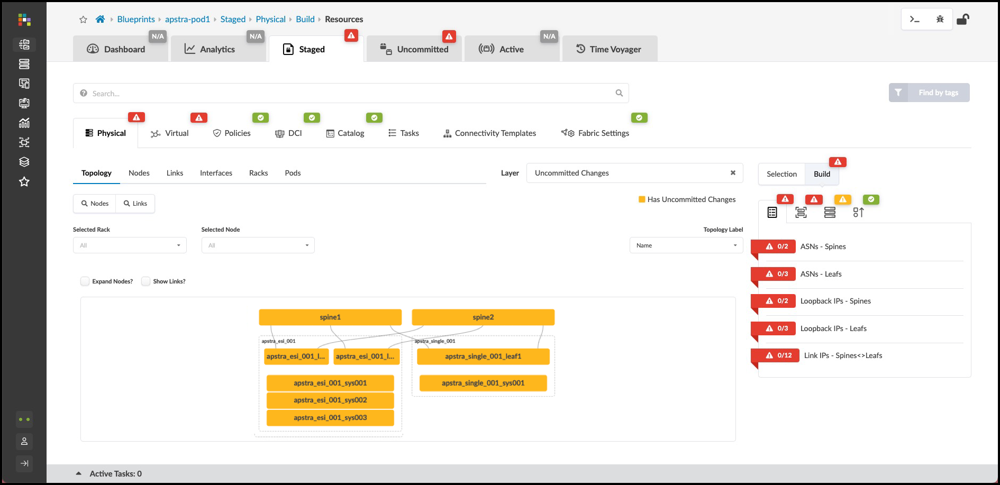

2. Click the red status indicator next to **ASNs - Spines**, then click **Update assignments**

3. Select the **Private-64512-65534** pool from the dropdown
4. Click **Save**. The red status indicator should turn green, indicating a successful assignment.
   
5. Repeat the same process for **ASNs - Leafs**, also selecting the **Private-64512-65534** pool.

### Assign IP Address Resources

Now let's assign IP addressing for device loopbacks and fabric links:

1. While still in the **Resources** tab, click the red status indicator next to **Loopback IPs - Spines**
2. Click **Update assignments** and select the **Private-192.168.0.0/16** pool
   
3. Click **Save** to apply the assignment
4. Repeat for **Loopback IPs - Leafs**, also selecting the **Private-192.168.0.0/16** pool
5. Next, click the red status indicator next to **Link IPs - Spines<>Leafs**
6. Click **Update assignments** and select the **Private-172.16.0.0/12** pool
7. Click **Save** to apply the assignment
8. Verify that all resource indicators have turned green, indicating successful assignments

> **TIP**  
> **Pro Tip:** Apstra automatically manages the allocation of addresses from these pools, ensuring there are no conflicts or overlaps. The system keeps track of all allocations and maintains the single source of truth for your network.

### Assign Interface Maps and Perform Our First Commit

This is where we're now telling Apstra what the underlying device will be, and this will enable it to take all of that intent and generate configuration for the switches you'll actually be using.

1. To the right of the **Resources** tab, select the **Device Profiles** tab.

   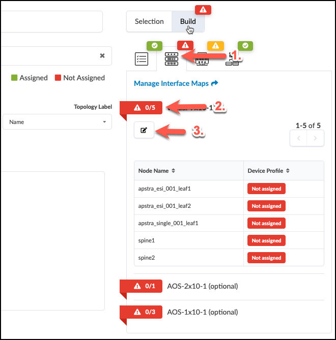
2. Click the red status indicator next to **virtual-7x10-1**, then click the **Change interface maps assignment** button.
3. Select interface maps for each device as shown in the table below.

   **Table Interface Map Assignment Values**

   | Name | Interface Map |
   |------|--------------|
   | evpn_esi_001_leaf1 | Juniper_vEX__slicer-7x10-1 |
   | evpn_esi_001_leaf2 | Juniper_vEX__slicer-7x10-1 |
   | evpn_single_001_leaf1 | Juniper_vEX__slicer-7x10-1 |
   | spine1 | Juniper_vEX__slicer-7x10-1 |
   | spine2 | Juniper_vEX__slicer-7x10-1 |

4. Click **Update Assignments** to assign the device models and return to the build page. After a moment the red status indicator turns green indicating that the assignment was successful.

## Exercise 3: Review the Rendered Configuration

Before you do your first commit on your blueprint, let's examine how Apstra has automated the complete configuration of your devices:

1. Navigate to **Staged > Physical > Topology**

2. Select one of your leaf switches by clicking on it

3. Click on the **Rendered Configuration** tab

   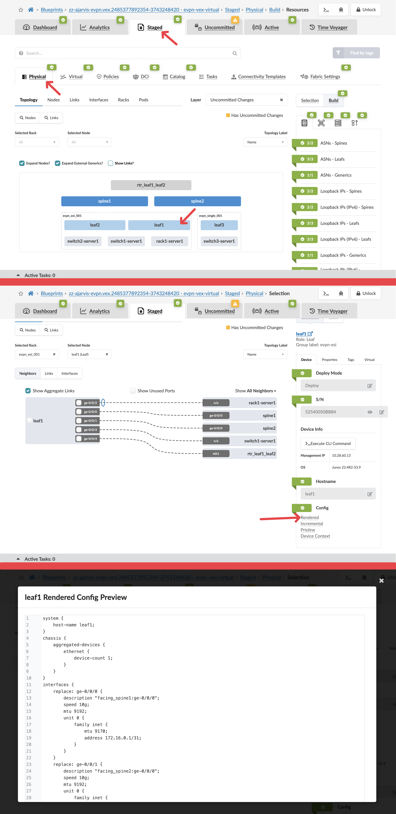

4. Scroll through the complete configuration that Apstra has generated automatically:

   > **NOTE**  
   > **Take a moment to appreciate what you're seeing here:**
   >
   > - A complete, ready-to-deploy device configuration
   > - All interface configurations with correct IP addressing
   > - BGP underlay configuration with proper ASNs and neighbours
   > - EVPN overlay configuration
   > - All VRF and routing configurations
   > - System settings and management access
   >
   > All of this was generated automatically based on your intent!

5. Notice that you didn't have to write a single line of this configuration. Apstra translated your high-level intent (rack types, templates, resource assignments) into detailed, vendor-specific configuration.

6. If you're familiar with network configuration, you'll recognise that creating this configuration manually would take hours per device and be prone to errors.

This demonstrates the power of Apstra's intent-based approach. You define what you want your network to do, and Apstra handles all the complex, device-specific implementation details. When your physical devices are connected, this configuration will be pushed to them automatically.

> **TIP**  
> **Pro Tip:** For multi-vendor environments, Apstra generates the appropriate vendor-specific configuration for each device type while maintaining consistent network behaviour. This means you can focus on your design intent rather than worrying about the syntax differences between vendors.

## Exercise 4: Commit Your Blueprint Changes

Now, let's save all our work with a commit. This records the current state of the blueprint and prepares it for eventual deployment.

1. Click the **Uncommitted** tab to see all staged changes

   This view shows the logical difference in the blueprint state since the last commit. Since this is our first commit, it shows everything we've added.

   You can see even more details by clicking the **Full Nodes Diff** tab.

2. After reviewing, click the **Commit** button in the upper right

3. Enter a description for this commit, such as "Initial blueprint creation with resource assignments"

   

   *Note: Descriptive commit messages are important for tracking changes, especially when using the Time Voyager feature to move between fabric snapshots.*

4. Click **Commit** to save your changes

## What You've Accomplished

Congratulations! You've now:

1. Created a complete software model of your network design using rack types and templates
2. Instantiated that design as a deployable blueprint
3. Assigned all necessary resources:
   - ASNs for spine and leaf switches from Private-64512-65534
   - Loopback IP addresses from Private-192.168.0.0/16
   - Fabric link IP addresses from Private-172.16.0.0/12
4. Made your first blueprint commit to record your work

In a full deployment scenario, you would continue by assigning interface mappings and system IDs, then deploy the blueprint to your physical devices. For this Test Drive, we'll now switch to an already-deployed blueprint to explore Day 2 operations.

## Understanding Resource Assignment

You've just experienced one of Apstra's key capabilities: automated resource management. Here's why this matters:

* **Eliminate IP conflicts:** Apstra ensures no overlapping IP addresses are assigned
* **Simplify planning:** No need to maintain complex spreadsheets for IP address management
* **Single source of truth:** All resource assignments are tracked and visible in one place
* **Automation:** Resources are automatically assigned to new devices as you scale

While we've used specific pools in this exercise, Apstra works with any valid addressing scheme. You can create your own pools with addressing that makes sense for your environment, and Apstra will ensure they're used correctly.

## Transition to Day 2 Operations

For the next section of our Test Drive, we'll be using a pre-configured blueprint called "SE Demo" that represents a fully deployed data centre fabric. This will allow us to focus on the operational aspects of Apstra without going through the complete deployment process.

Let's take a break here, and when we return, we'll switch to the SE Demo blueprint to explore Apstra's powerful Day 2 operational capabilities.

Now that we've explored how Apstra enables you to design and deploy a network, let's dive into where Apstra truly shines: ongoing operations and management of your data centre fabric.

For this section, we'll use a pre-configured blueprint called "SE Demo" that represents a fully operational data centre. This allows us to focus on the operational capabilities without completing the full deployment process.

## Switching to the SE Demo/SE Flow Blueprint

1. Return to the Apstra main menu and navigate to **Blueprints**
2. Find and select the **SE Demo** or the **SE Flow** blueprint depending on what has been deployed for you
3. You'll now see the dashboard for this running network

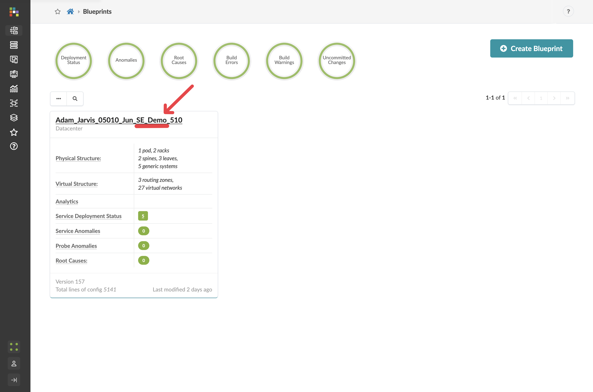


## Understanding the Dashboard

The dashboard gives you an immediate view of your network's health and status. Let's explore what we're seeing:


Key components of the dashboard include:

* **Health Status**: Overall fabric health at a glance
* **Anomalies**: Any issues that require attention
* **Fabric Devices**: Status of all switches in the fabric
* **Uncommitted Changes**: Work that has been staged but not yet committed
* **Recent Activity**: History of changes and events

Take a moment to explore the dashboard. Notice that everything is green, indicating a healthy network with no current issues.

## What We'll Cover Next

Over the next 90 minutes, we'll explore how Apstra makes day-to-day network operations dramatically simpler and more reliable. We'll cover:

1. **Scaling your network**:
   - Adding a new rack to expand capacity
   - Adding new virtual networks
   - Connecting new servers
2. **Network Connectivity**:
   - Setting up external BGP peering
   - Managing routing and switching configurations
3. **Network Management**:
   - Using Time Voyager to roll back changes
   - Troubleshooting and resolving issues
4. **Analytics and Visibility**:
   - Exploring built-in analytics
   - Creating custom analytics probes
   - Understanding how analytics stay in lockstep with your network intent

Let's begin by exploring how to expand your operational data centre without disrupting existing services!

**Scenario: Expanding Your Data Centre for a New Big Data Analytics Service**

*Your company has decided to launch a new revenue-generating Big Data Analytics service for customers. This initiative requires expanding your data centre infrastructure to support:*

1. *Additional compute capacity (new rack with servers)*
2. *Network segmentation for the new service (new routing zone/VRF)*
3. *Multiple application tiers for the analytics platform (web front-end and database back-end)*
4. *External connectivity for customer access*

*As the network operations team, you need to implement these changes quickly and reliably. Fortunately, your data centre runs on Apstra, making these operations straightforward and risk-free.*

*Let's jump in!*

## Scenario: Adding Capacity for the Big Data Analytics Service

Your company has just greenlit a new Big Data Analytics service offering for customers. The first task is to expand the physical capacity of your data centre by adding a new rack of switches and servers to support the increased compute requirements.

## Task: Add a New Rack to Your Data Centre

> **TIP**  
> **Reflection Point:** Before we begin, take a moment to consider what this would involve in a traditional data centre:
>
> * How would you provision a new pair of switches from scratch?
> * How would you ensure consistency with existing network configurations?
> * How long would it take to:
>   * Plan IP addressing and ASN assignments
>   * Configure basic switch setup (management, credentials)
>   * Configure underlay protocols (BGP)
>   * Configure overlay protocols (EVPN, VXLAN)
>   * Test connectivity
>   * Troubleshoot issues
>
> Many organisations report this process taking days or even weeks for a single rack addition when done manually.

With Apstra, we'll accomplish this in just a few minutes. Let's begin!

### Step 1: Navigate to the SE Demo Blueprint

1. From the Apstra main menu, select **Blueprints**
2. Click on the **SE Demo** blueprint to open it

### Step 2: Add a New Rack to the Blueprint

The easiest and fastest way to expand your network is to add a rack:

1. Navigate to Staged > Staged > Physical > Racks
2. Click the **Add Racks** button (+)

   

3. From the **Rack Type** drop-down list, select ***your_name*-esi** (the dual-switch redundant rack with ESI that you designed in Part 1)
4. Leave the number of racks at **1**
5. Click **Add** to stage the rack addition and return to the topology view

   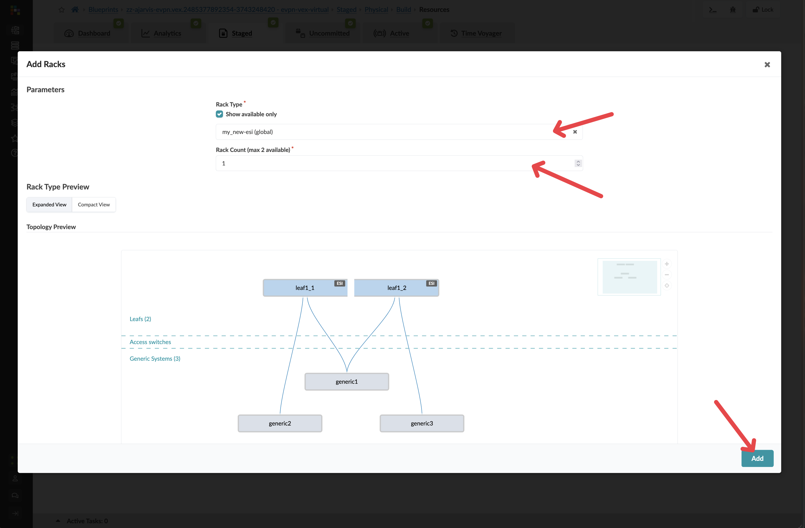

   > **TIP**  
   > **Key Insight:** At this point, you've just prestaged a rack addition without needing any physical hardware. Apstra allows you to plan and prepare your network expansion before the physical switches even arrive in your data centre.

### Step 3: Let Apstra Handle Resource Allocation

When you add a new rack, you will need to add new IPs and ASNs. Apstra does this for you, taking the next items from your resource pools.

*You don't need to do a thing, it does it for you*

### Step 4: Assign Device Profiles

1. Navigate to Staged > Staged > Physical > Device Profiles

   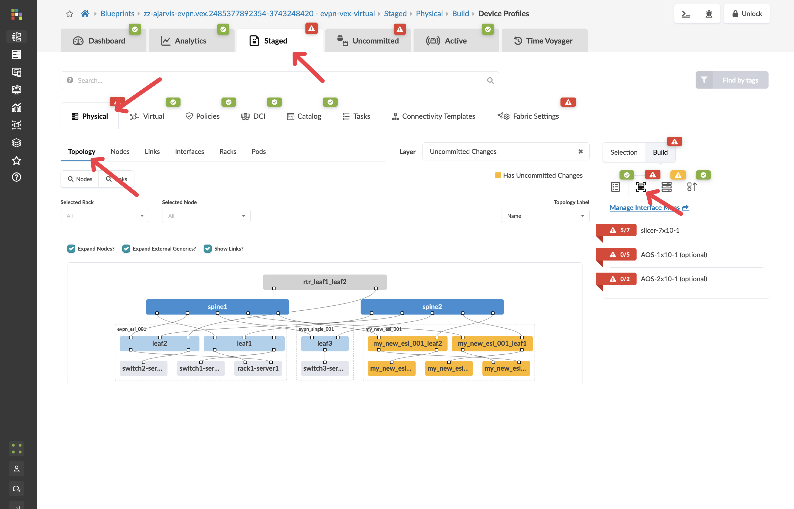
2. If there are any red indicators for your new leaf switches, click them, then click **Change interface maps assignment**

   
3. Select **Juniper_vEX__slicer-7x10-1** as the interface map for your new leaf switches, you were telling Apstra what the underlying devices will be.
4. Click **Update Assignments**

### Step 5: Review and Commit Your Changes

1. Click the **Uncommitted** tab to see all your staged changes

   > **TIP**  
   > Take a moment to review what Apstra is preparing for you. Notice how the system has automatically:
   >
   > * Created a plan for assigning unique ASNs to the new devices
   > * Prepared IP addressing for all interfaces
   > * Set up BGP peering configurations between the new leaf switches and existing spine switches
   > * Prepared EVPN configurations for the overlay network

2. After reviewing, enter a commit message like "Prestaged new analytics rack" and click **Commit**. Make sure to give it a meaningful description.

   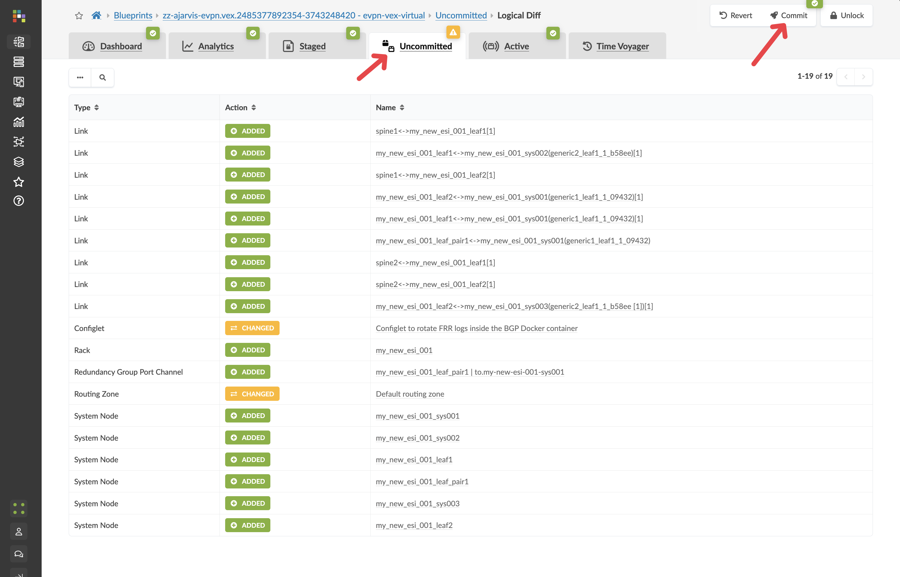

### Step 6: Understanding the Power of Prestaging

What makes this workflow revolutionary is that:

1. **No physical devices needed yet:** You've prestaged the entire configuration before the physical switches even arrive at your data centre
2. **Instant deployment when hardware arrives:** When the physical switches do arrive, you simply:
   - Rack and cable the switches according to your design
   - Add the devices to Apstra's management
   - Map them to the prestaged leaf switches in your blueprint
   - The full configuration will be pushed to them in seconds
3. **Zero-touch integration:** The new switches will be fully deployed, configured, and monitored as part of your fabric immediately
4. **Network-wide consistency:** All existing devices that need to communicate with these new switches will be automatically updated to include them in the fabric

### Step 7: Examine the Prepared Configuration

Let's look at what Apstra has prepared:

1. Navigate to Staged > Staged > Physical > Topology
2. Find one of your newly added leaf switches and click on it

   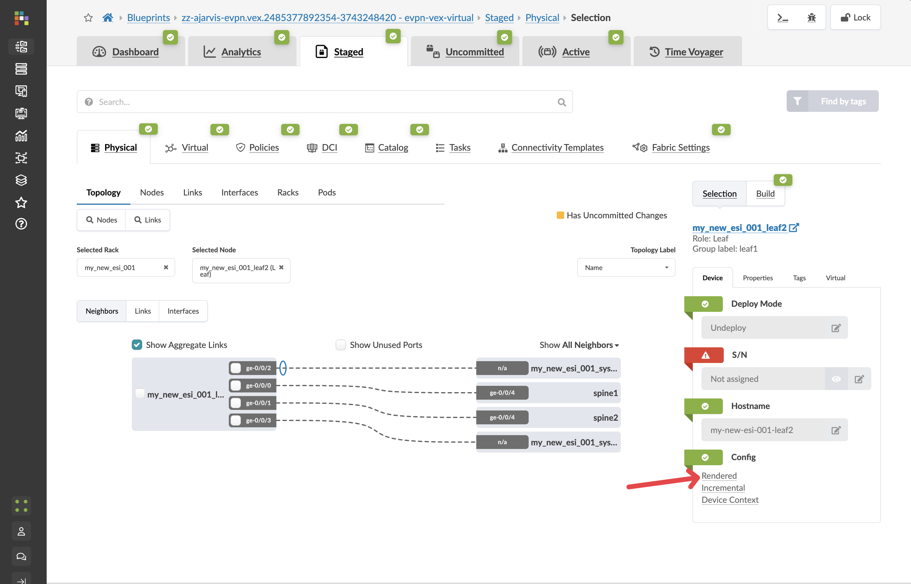
3. Click on the **Rendered Configuration** tab
4. Review the complete configuration that Apstra has generated. Notice:
   - Basic system configuration
   - Interface configurations
   - BGP underlay configuration
   - EVPN overlay configuration
   - All IP addressing

   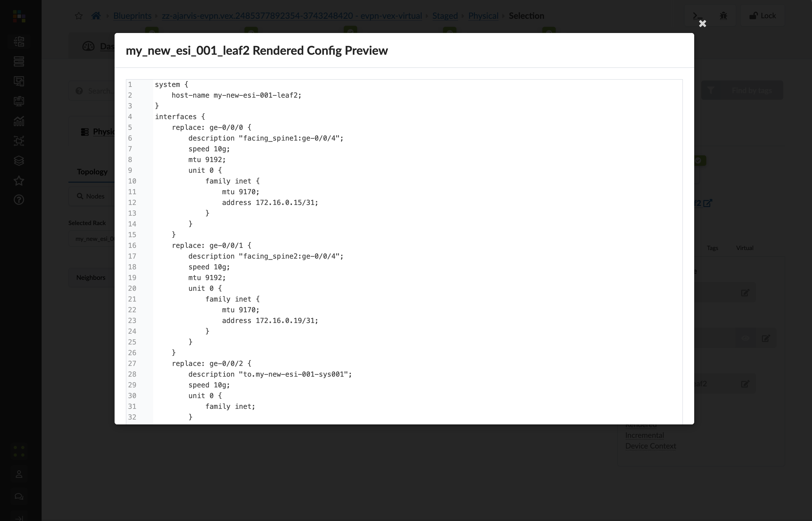

   > **TIP**  
   > This entire configuration was generated automatically because Apstra understands your network as a complete system. When the physical devices are added, this configuration will be deployed to them, and the system will also automatically update configurations on the spine switches to establish BGP sessions with these new devices.

## What You've Accomplished

In just a few minutes, you've:

1. Prestaged a new rack with redundant leaf switches to your data centre
2. Created a plan for all necessary resources (ASNs, IP addresses)
3. Generated complete device configurations that will be ready when the hardware arrives
4. Prepared updates for existing devices to incorporate the new rack into the fabric

In a traditional networking environment, this entire process would require extensive planning, manual configuration, and troubleshooting once the hardware arrives. With Apstra, you can prepare everything in advance and deploy instantly when hardware is available.

Next, we'll continue expanding our Big Data Analytics service by creating a new routing zone to logically separate this service from other workloads.

## Scenario: Creating Network Isolation for the Big Data Analytics Service

Now that we've expanded our physical capacity by adding a new rack, the next step is to create logical network isolation for our Big Data Analytics service. This isolation ensures that the analytics platform has its own routing domain, separate from other services running in the data centre.

In Apstra, this isolation is achieved using **Routing Zones** (also known as VRFs in traditional networking terms).

## Task: Create a New Routing Zone

> **TIP**  
> **Reflection Point:** In traditional networking, creating a new VRF would involve:
>
> * Planning the VRF configuration details (name, route distinguisher, route targets)
> * Configuring the VRF on each switch that needs it
> * Setting up import/export policies for route exchange
> * Ensuring consistency across all devices
>
> This process is both time-consuming and error-prone, especially as the network scales.

Let's see how simple this is with Apstra!

### Step 1: Navigate to Routing Zones

1. From the SE Demo blueprint, navigate to Staged > Staged > Virtual > Routing Zones
2. Click **Create Routing Zone**

   

### Step 2: Create the Routing Zone

1. Enter a name for the routing zone: **Analytics**

   > **NOTE**  
   > This is the only required field! Everything else is optional.

2. Leave all other fields at their default values

   

3. Click **Save**

### Step 3: Resource Assignment

After creating the routing zone, Apstra will identify any resources that need to be assigned:

1. If prompted, assign the EVPN L3 VNIs pool for the routing zone

   > **TIP**  
   > Apstra automatically manages the assignment of VNIs (Virtual Network Identifiers) from the pool already selected
   > 

2. Click **Save**
3. Your new routing zone will now be listed in the Routing Zones table

### Step 4: Understanding What Just Happened

Before you commit on your blueprint, let's examine how Apstra has automated the complete configuration of your devices:

1. Navigate to **Staged > Physical > Devices**

2. Select one of your leaf switches by clicking on it
   

3. Click on the **Incrimental Configuration** tab
   
   

While this process seemed incredibly simple from your perspective (just enter a name!), Apstra has actually handled numerous complex configurations behind the scenes:

* **Created a unique VRF** (Virtual Routing and Forwarding instance) for the Analytics service
* **Assigned a route distinguisher** for EVPN route differentiation
* **Applied default routing policies** from the ones that ship with the product
* **Selected appropriate route targets** for import/export
* **Prepared configurations** for all devices that will need this VRF

Apstra's intent-based approach means you only need to express what you want (a new routing zone called "Analytics"), and the system takes care of how to implement it properly across your network.

**But the incremental config is empty?**

An important concept to understand is that Apstra deploys resources only where they're needed:

> **TIP**  
> **Key Insight:** A VRF (routing zone) is only deployed to a switch when a virtual network in that VRF is configured on that switch. Otherwise, the VRF isn't configured on that device.
>
> This means:
>
> * You can create many routing zones without consuming resources on every device
> * Adding a virtual network to a new rack automatically brings the associated routing zone to that rack
> * Resources are efficiently used across your network

### Step 5: Review and Commit Your Changes

1. Click the **Uncommitted** tab to see your staged changes

   > **TIP**  
   > Take a moment to review what Apstra is preparing to configure

2. After reviewing, enter a commit message like "Added Analytics routing zone" and click **Commit**

## What You've Accomplished

In less than a minute, you've:

1. Created a new routing zone (VRF) for your Analytics service
2. Automatically applied industry best practices for VRF configuration
3. Prepared the foundation for creating virtual networks within this isolated routing domain

In a traditional networking environment, this same task would require significant planning and configuration effort across multiple devices. With Apstra, you simply express your intent, and the system handles all the implementation details.

Next, we'll create the virtual networks within this routing zone to support the different tiers of our Big Data Analytics platform.

## Scenario: Building Network Tiers for the Big Data Analytics Service

With our physical capacity expanded and a dedicated routing zone created, we now need to establish the network segments for our Big Data Analytics service. This service requires two separate network tiers:

1. A web-facing tier for the analytics dashboard and user interface, which requires extra security controls
2. A backend tier for the database and processing components

In Apstra, we'll implement these as virtual networks within our Analytics routing zone.

## Task: Create Virtual Networks for the Analytics Service

> **TIP**  
> **Reflection Point:** In traditional networking, creating virtual networks would involve:
>
> * Configuring VLANs on each relevant switch
> * Setting up VXLAN VNIs and mappings
> * Configuring L2/L3 boundaries
> * Ensuring consistent configuration across devices
> * Manually tracking which segments are deployed to which racks
>
> This process becomes exponentially complex as your network grows.

Let's see how Apstra simplifies this!

### Step 1: Create the Analytics Web Tier Network (Layer 2 Only)

1. From the SE Demo blueprint, navigate to Staged > Staged > Virtual > Virtual Networks
2. Click **Create Virtual Network**

   

3. Configure the network with these settings:

   | Parameter | Value |
   |-----------|-------|
   | Type | VXLAN |
   | Name | analytics-web |
   | Routing Zone | Analytics (the zone we just created) |
   | IPv4 Connectivity | **Disabled** |

   

   > **TIP**  
   > **Security Design Decision:** By disabling IPv4 Connectivity, we're creating a Layer 2 only network (bridged overlay). This means:
   >
   > * The gateway for this network will reside on an external firewall, not on the leaf switches
   > * This provides enhanced security for our customer-facing web tier, allowing for additional inspection and filtering of traffic
   > * All inter-VLAN routing will pass through the firewall where security policies can be enforced

4. In the **Create Connectivity Templates for** section, select **Tagged** 
5. In the **Assigned To** section, select **all racks** in your fabric

   

   > **TIP**  
   > While you have the flexibility to deploy virtual networks selectively, in this case we want the web tier available across the entire fabric to allow for flexible workload placement.

6. Click **Create** to create the virtual network

### Step 2: Create the Analytics Database Tier Network (Layer 3)

1. Click **Create Virtual Network** again
2. Configure the network with these settings:

   | Parameter | Value |
   |-----------|-------|
   | Type | VXLAN |
   | Name | analytics-db |
   | Routing Zone | Analytics |
   | IPv4 Connectivity | **Enabled** |
   | IPv4 Subnet | 10.1.2.0/24 |
   | Virtual Gateway IP | 10.1.2.1 |

   

   > **TIP**  
   > **Network Design Note:** For this network, we've enabled Layer 3 functionality:
   >
   > * This creates a gateway (10.1.2.1) directly on the leaf switches
   > * Traffic can be routed between this network and others in the same routing zone
   > * Instead of manually entering the subnet, you could have selected an IP pool, which would automatically assign the next available subnet from that pool

3. In the **Create Connectivity Templates for** section, select **Tagged** 
4. In the **Assigned To** section, select **all racks** in your fabric
5. Click **Create** to create the second virtual network

   

### Step 3: Assign Resources to Virtual Networks

There should not be any needed after creating the virtual networks, Apstra will identify any resources that need to be assigned:

1. If there are any red resource indicators, click them and assign the appropriate pools
2. Click **Save** to complete the assignments

### Step 4: Assign Resources to the Routing Zone

After creating the virtual networks to switches, Apstra will identify any resources that need to be assigned under the routing zone:

> **NOTE**  
> **Why?** 
>
> Previously we added the routing zone, but the configuration was never pushed because no virtual network using that routing zone existed. Now we're actually pushing our virtual networks to every switch. The fabric requires loopbacks in order to operate.
>
> In this example, we actually have IPv4 and IPv6 turned on, hence why loopbacks for both address types are needed.

1. If there are any red resource indicators, click them and assign any of the pools
2. Click **Save** to complete the assignments

   

Apstra has now autoassigned all of the needed loopback addresses.

### Step 5: Review and Commit Your Changes

Before you commit on your blueprint, let's examine how Apstra has automated the complete configuration of your devices:

1. Navigate to **Staged > Physical > Devices**

2. Select one of your leaf switches by clicking on it

   

3. Click on the **Incrimental Configuration** tab

   
   

This will show you all of the incremental configuration that has been generated based on the very few clicks you've had to do. You have successfully now deployed a new VRF and multiple VXLAN overlays, not to mention the adjustments that are needed to the EVPN protocol configuration.

4. Click the **Uncommitted** tab to see your staged changes

   > **TIP**  
   > Review the changes Apstra is preparing to make across your fabric

5. Enter a commit message like "Added Analytics virtual networks" and click **Commit**

## What You've Accomplished

You've just:

1. Created a Layer 2 only network for your web tier, where gateways will be hosted on an external firewall for enhanced security
2. Created a Layer 3 virtual network for your database tier, with integrated routing on the leaf switches
3. Deployed both networks across all racks for maximum flexibility
4. Let Apstra handle all the complex VXLAN, VRF, and routing configurations automatically

In a traditional environment, creating these network segments would require configuring VLANs, VXLANs, SVIs, routing policies, and more across multiple devices. With Apstra, you simply declare what networks you need and their characteristics, and the system handles all implementation details consistently across your fabric.

Next, we'll connect servers to these new virtual networks to complete our Analytics service deployment.

## Scenario: Deploying Analytics Platform Servers

Now that we have our physical capacity expanded and our virtual networks created, we need to deploy the actual servers that will run our Big Data Analytics platform. Specifically, we need to add servers to the new rack we created earlier.

In Apstra, servers are represented as **Generic Systems** and can be easily connected to your fabric.

## Task: Add a New Analytics Server to the Fabric

> **TIP**  
> **Reflection Point:** In traditional networking, adding a new server would involve:
>
> * Determining the correct switch ports to use
> * Configuring VLANs on those ports
> * Setting up port profiles and security settings
> * Documenting the connections for future reference
>
> Each step is manual and error-prone, especially across a large data centre.

Let's see how Apstra makes this simple!

### Step 1: Navigate to the Topology View

1. From the SE Demo blueprint, navigate to Staged > Physical > Topology
2. Locate the new rack you added earlier in the topology view
3. Click on one of the leaf switches in the new rack to select it

   

### Step 2: Add a Generic System

1. With the leaf switch selected, click the box to the left of the device's name
2. From the menu that appears, select **Add internal/external generic system**

   
3. In the dialog that appears, configure the system:

   | Parameter | Value |
   |-----------|-------|
   | Generic Type | **Internal** |
   | Name | analytics-server-1 |
   | Hostname | analytics-server-1 |
   | Logical Device | AOS-2x10-1 (a dual-interface server) |

4. Click **Next** to proceed to the link configuration

   

### Step 3: Configure the Connections

Since we selected a dual-interface logical device, we'll need to create redundant connections to both leaf switches in our rack:

| Step | Action | Details |
|------|--------|---------|
| 1 | For the first leaf switch | * Select an available port (e.g., port 4)<br>* Set speed to 10Gbps |
| 2 | Add to link list | Click Add Link to add this connection to your link list |
| 3 | For the second leaf switch | * Select an available port (e.g., port 4)<br>* Set speed to 10Gbps |
| 4 | Add to link list | Click Add Link to add this connection to your link list |


1. Set **Deploy mode** to **Deploy**
2. Select LACP mode **active**
3. Review both links to ensure they're configured correctly
4. Click **Create** to add the generic system and its connections to your fabric

   

### Step 4: Verify the Generic System

After adding the server, you should see it appear in the topology view connected to both leaf switches in your new rack:

1. The links should appear as connections in the topology
2. You can click on the server to see its details
3. Navigate to Staged > Staged > Physical > Nodes to see a list of all generic systems, including your new server

   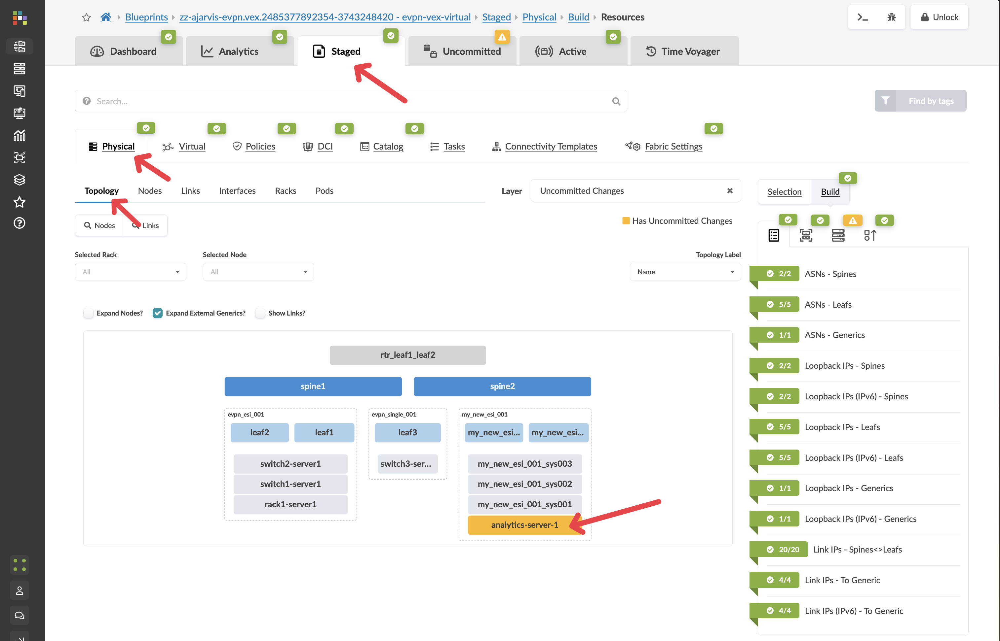

### Step 5: Understanding the Benefits

By modelling servers in Apstra as generic systems, you gain several advantages:

1. **Documentation:** The physical connectivity is documented in your single source of truth
2. **Visibility:** You can see exactly where each server is connected in your fabric
3. **Automation:** Port configurations can be automated based on your intent
4. **Consistency:** All server connections follow the same design patterns

### Step 6: Review and Commit Your Changes

Before you commit on your blueprint, let's examine how Apstra has automated the complete configuration of your devices:

1. Navigate to **Staged > Physical > Devices**

2. Select one of your leaf switches by clicking on it

   

3. Click on the **Incrimental Configuration** tab

   
   

This will show you all of the incremental configuration that has been generated. As all we have done is added the server, and not attached it to any of our VXLAN overlays only the speed and description has been set.

4. Click the **Uncommitted** tab to see your staged changes
5. Review the changes Apstra will make to implement your server addition
6. Enter a commit message like "Added analytics server to new rack" and click **Commit**

## What You've Accomplished

You've just:

1. Added a new server to your fabric with redundant connections
2. Documented this server in your network's single source of truth
3. Prepared the physical connectivity for your Analytics platform

In the next task, we'll use Connectivity Templates to connect this server to our virtual networks, so it can serve as part of our Analytics platform.

## Scenario: Connecting Servers to the Analytics Networks

Now that we've added our analytics server to the fabric, we need to connect it to the virtual networks we created. In traditional networking, this would involve configuring VLANs on the switch ports connected to the server, possibly with trunk configurations and careful tracking of which VLANs are allowed.

Apstra simplifies this process using **Connectivity Templates**, which define how servers connect to virtual networks. By applying these templates to server interfaces, Apstra automatically configures the appropriate switch ports.

## Task: Apply Connectivity Templates to Analytics Server

### Step 1: Understand Connectivity Templates

Connectivity Templates define how endpoints connect to your network. They can be:

1. **Auto-generated** when you create a virtual network
2. **Custom-created** for specific connectivity scenarios

When we created our virtual networks earlier, Apstra automatically generated connectivity templates for each one. Now we'll use these to connect our server.

> **NOTE**  
> If you don't have these let us know but you need to go back to the virtual network tab, select the virtual networks and you'll see an export symbol.

### Step 2: Locate the Connectivity Templates

1. From the SE Demo blueprint, navigate to Staged > Staged > Connectivity Templates
2. You should see templates for the virtual networks we created:
   - **Tagged VxLAN 'analytics-web'** - This template connects endpoints to our web tier
   - **Tagged VxLAN 'analytics-db'** - This template connects endpoints to our database tier

   

By clicking on one of the connectivity templates, you can see how they are built and we will explore this in the next section.


### Step 3: Assign the Analytics-Web & Analytics-DB Template to Server Interfaces

1. Return to the Connectivity Templates view
2. Select both **Tagged VxLAN 'analytics-web'** and **Tagged VxLAN 'analytics-db'** templates and click the **Assign** icon at the top

   
3. Check the boxes next to the same interfaces for your analytics server
4. Click the **Assign** button

   

> **TIP**  
> **What's happening:** Apstra is now configuring these ports facing the analytics server. Since this is a Layer 2 network, the switch ports will be configured to carry the VLANs that are automatically mapped to the VXLANs, and the server will now be able send and receive traffic from these networks.

> **TIP**  
> **Multi-VLAN Access:** By assigning both templates to the same interfaces, the port can carry both VLANs. The server can now access both networks, which is perfect for an analytics application that needs both web and database tiers.

### Step 4: Understand What Apstra Is Automating

When you assign connectivity templates, Apstra is automatically:

1. **Configuring VLANs** on the switch ports
2. **Setting up trunk ports** with the appropriate allowed VLANs
3. **Mapping VLANs to VXLANs** for fabric-wide transport
4. **Creating Redundancy Groups** when needed such as EVPN ESI LAGs
5. **Ensuring consistency** across redundant connections
6. **Documenting connectivity** in the single source of truth

This eliminates manual port configuration and significantly reduces the chance of errors.

### Step 5: Review and Commit Your Changes

Before you commit on your blueprint, let's examine how Apstra has automated the complete configuration of your devices:

1. Navigate to **Staged > Physical > Devices**

2. Select one of your leaf switches by clicking on it

   

3. Click on the **Incrimental Configuration** tab

   
   

This will show you all of the incremental configuration that has been generated.

4. Click the **Uncommitted** tab to see your staged changes
5. Review the port configurations Apstra will apply
6. Enter a commit message like "Connected analytics server to virtual networks" and click **Commit**

## What You've Accomplished

You've just:

1. Connected your analytics server to both the web and database networks
2. Automated the VLAN and port configurations on the leaf switches
3. Documented this connectivity in your network's single source of truth

Your server is now connected to both virtual networks and can communicate with other devices in these networks. This completes the internal configuration of our Analytics platform.

Next, we'll set up external connectivity to allow outside access to our Analytics service.

## Scenario: Enabling External Access to the Analytics Service

The final step in deploying our Big Data Analytics service is to set up external connectivity. Customers need to access the analytics platform from outside our data centre, which requires setting up BGP peering with an external router or firewall. Additionally, we need to ensure our Layer 2 web tier has its gateway on an external firewall for enhanced security.

In this task, we'll create an external router and configure BGP peering to connect our Analytics routing zone to the outside world.

## Task: Configure External Connectivity for the Analytics Service

> **TIP**  
> **Reflection Point:** In traditional networking, setting up external connectivity would involve:
>
> * Configuring physical interfaces on border leaf switches
> * Setting up BGP peering parameters (ASNs, timers, etc.)
> * Creating route policies for import/export
> * Ensuring consistent configuration across redundant devices
>
> This process is complex and error-prone, with serious consequences if misconfigured.

Let's see how Apstra simplifies this mission-critical task!

### Step 1: Add an External Generic System

First, we'll create an external device to represent our edge router or firewall:

1. Navigate to Staged > Physical > Topology
2. Select a border leaf switch that will connect to the external world

   
3. With the switch selected, click the box to the left of the device's name
4. From the menu, select **Add internal/external generic system**

   

5. Configure the external system:

   | Parameter | Value |
   |-----------|-------|
   | Generic Type | **External** |
   | Name | analytics-edge-router |
   | Hostname | analytics-edge-router |
   | Logical Device | None |

   

> **TIP**  
> **Why External Generic System?** We're using an external generic system because this device lives outside of our typical rack structure and represents equipment external to the data centre that provides connectivity to the outside world. In this case, it will also serve as the Layer 3 gateway for our analytics-web virtual network.

6. Click **Next** to configure the links

### Step 2: Configure the External Links

1. For the selected leaf2 switch:
   - Choose an available port (e.g., port 5)
   - Set speed to **10Gbps**
   - Set **Deploy mode** to **Undeploy**
     - We don't actually have this firewall yet but we are just staging the peering for when it is installed and we then set this external generic system to **deployed**
   - Add a tag: **Router**
2. Click **Add Link** to add this connection
3. If you want redundancy (recommended), repeat for a second border leaf:
   - Choose a corresponding port
   - Set the same parameters
   - Add the same tag
4. Click **Create** to add the external router

   

### Step 3: Configure External Router Properties

Before creating the connectivity template, we need to configure the ASN and loopback IP for our external router:

1. Click on your **analytics-edge-router**

   
2. Click the **Properties** tab
3. Configure the ASN and loopback IP:

   | Parameter | Value |
   |-----------|-------|
   | ASN | 65000 (or another appropriate external ASN) |
   | Loopback IP | 192.168.100.1/32 (or another appropriate IP) |

4. Click the **Edit** icon for each field and save your changes

   

> **NOTE**  
> These values are essential for the BGP peering relationship between your fabric and the external router. The ASN must be different from the ASNs used within your fabric.

### Step 4: Create Connectivity Using a Predefined Template

Think of Connectivity Templates as your way of expressing network connectivity intent rather than just mapping interfaces to VLANs. While traditional networking has you manually configuring individual switch ports with VLANs/VXLANs, Apstra's Connectivity Templates create a higher-level abstraction that defines 'the way things connect' to your network.

Yes, at first glance, it might seem more complex than simply typing 'switchport access vlan 100' on an interface. But what Connectivity Templates give you is immensely more powerful:

* Consistency across your fabric: Define the connectivity pattern once, apply it consistently everywhere.
* Multi-faceted connections: It's not just about mapping to a single VLAN. Templates can include multiple parameters static routes, BGP peerings, constraints, etc.
* Intent-based approach: You're expressing what you want to achieve (connect this server to this virtual network) rather than how to configure it on specific hardware.
* Automated implementation: The template knows how to implement itself across different switch vendors and models.
* Reusability: Create the template once, use it for all similar connections.

For example, when we assigned our 'analytics-web' template to server interfaces, Apstra automatically configured the appropriate VLANs, VXLAN mappings, and trunk settings across redundant switches. If we had dozens of similar servers to connect, we'd apply the same template in seconds rather than configuring each port manually.
It's like the difference between writing configuration commands for every port versus declaring 'these servers belong to the web tier' and letting the system handle the details.

Now we'll use a predefined connectivity template type to set up the connection between our fabric and the external router:

1. Navigate to Staged > Staged > Connectivity Templates
2. Click **Add Template**

   
3. Give your connectivity template the title

   
4. In the dialog, click the **Predefined Templates** tab
5. Select **BGP over L3 Connectivity** from the list of predefined templates
6. Select the cog next to the IP Link box

   

   | Parameter | Value |
   |-----------|-------|
   | Title | analytics-external-peering |

7. Configure the IP link settings

   

   | Parameter | Value |
   |-----------|-------|
   | Virtual Network | analytics-web |
   | Interface Type | Untagged |
   | IPv4 Addressing Type | Numbered |

> **TIP**  
> **Key Point:** We're connecting to the analytics-web virtual network because we want this external router to serve as the gateway for our web tier, as discussed earlier when we created the Layer 2 only network.

8. For the BGP Peering section, you can leave the default settings as they are. The external generic system's ASN and loopback IP that we configured earlier are all that's needed for the peering relationship.

   

9. For the Routing Policy section, this is completely optional:
   - You can delete it
   - You can select **Default Immutable Policy** (which ships with Apstra)
   - You could create a custom routing policy if you wanted different constraints and control for this particular BGP peering compared to the rest of the VRF

   

> **TIP**  
> **Flexibility Note:** The ability to specify different routing policies for different BGP peers gives you fine-grained control over routing behaviour when needed.

10. Click **Create** to create the template

### Step 5: Assign the Connectivity Template

1. Find and select your new **analytics-external-peering** template in the list
2. Click the **Assign** icon

   
3. Check the boxes next to the interfaces connected to your external router
4. Click **Assign**

   

### Step 6: Assign Resources for External Peering

You will need to assign IP resources for the external peering:

1. Navigate to Staged > Staged > Virtual > Routing Zones
2. Look for any red indicators related to your external connectivity
3. Assign appropriate resource pools as needed

   

> **NOTE**  
> **Note:** You can also assign these IP's manually, you do not need to use a pool of addresses

### Step 7: Review and Commit Your Changes

Before you commit on your blueprint, let's examine how Apstra has automated the complete configuration of your devices:

1. Navigate to **Staged > Physical > Devices**

2. Select one of your leaf switches by clicking on it

   

3. Click on the **Incrimental Configuration** tab

   
   

This will show you all of the incremental configuration that has been generated.

4. Click the **Uncommitted** tab to review your staged changes
5. Enter a commit message like "Added external connectivity for Analytics service" and click **Commit**

## What You've Accomplished

You've just:

1. Created an external router connection for your Analytics service in "Undeploy" mode (meaning it's modelled but not yet fully configured)
2. Set up BGP peering between your fabric and the external world
3. Connected your Layer 2 analytics-web network to this external router, which will serve as its gateway
4. Used a predefined connectivity template to simplify the configuration process
5. Had the option to customise routing policies for this specific connection

This external connectivity setup accomplishes two critical goals:

1. It provides a path for external users to access your Analytics service
2. It implements your security design by routing web tier traffic through an external firewall

In a traditional environment, setting up external connectivity is one of the most complex and risky operations. With Apstra, you've defined your intent for external connectivity, and the system has handled all the implementation details.

## The Complete Analytics Service

Congratulations! You've now completed the entire deployment of your new Big Data Analytics service:

1. **Expanded physical capacity** by adding a new rack
2. **Created network segmentation** with a dedicated routing zone
3. **Set up virtual networks** for the web and database tiers
4. **Connected servers** to these networks
5. **Established external connectivity** for customer access

All of this was accomplished through Apstra's intent-based approach, where you defined what you wanted to achieve, and the system handled the complex implementation details across your entire fabric.

## The Power of Context-Aware Monitoring

Now that we've built our Analytics service, let's examine one of Apstra's most powerful capabilities: Intent-Based Analytics (IBA). Unlike traditional monitoring, which is often an afterthought in network deployments, monitoring in Apstra is fundamental to the system and stays in lockstep with your network as it evolves.

## Understanding Closed-Loop Validation

Apstra operates on a principle of **closed-loop validation** - a transformative approach to network monitoring that fundamentally changes how you ensure network health.

> **TIP**  
> **Traditional Monitoring vs. Apstra's Approach**
>
> In traditional monitoring systems:
>
> * You collect data from devices but lack context for what's "normal"
> * You see state information (up/down, traffic levels) without understanding intent
> * You can't easily identify unexpected changes or additions
> * Example: You might see "15 BGP peers are up" and think everything is fine, but not realise you originally only deployed 12 peers. What are those extra 3 peers?
>
> With Apstra's Intent-Based Analytics:
>
> * The system understands your intended design
> * Telemetry is collected and evaluated against this known intent
> * Any deviation from intent is automatically flagged
> * Example: If you designed your fabric with 12 BGP peers, and suddenly there are 15, Apstra immediately flags this as an anomaly

This contextual understanding is only possible because Apstra knows the full context of your network - all physical and logical elements, interfaces, virtual networks, BGP peerings, and how they should behave according to your design intent.

## Navigating the Monitoring Features

Apstra offers two primary monitoring views, each serving a different purpose:

### The Main Dashboard

Navigate to the main dashboard of your blueprint:

1. This dashboard shows you immediate issues affecting the fabric
2. It presents a high-level health status of your network
3. It focuses on anomalies that require attention to maintain proper operation
4. Think of this as your "operational health" view - what needs attention now


### The Analytics Dashboard

Navigate to **Analytics** in your blueprint:

1. This dashboard focuses on how your network is performing
2. It presents detailed telemetry data about various aspects of your fabric
3. It allows you to track trends, patterns, and potential issues before they become problems
4. Think of this as your "performance and compliance" view - how things are trending

## Intent-Based Analytics Components

Apstra's IBA system consists of three main components:

1. **Built-in Detections**: Always running, these detect fundamental issues like configuration deviations, unreachable devices, and link flaps.
2. **Predefined Probes**: Ready-to-use analytics that you can instantiate to monitor specific aspects of your network, such as:
   - Interface error rates
   - Packet discard percentages
   - BGP session stability
   - Interface bandwidth utilisation
3. **Custom Telemetry Collection**: For ultimate flexibility, you can create custom analytics to collect and visualise any data available from your switches.


Let's look at how to instantiate a predefined probe to monitor our network.

Apstra ships with a number of IBA Analytics Dashboards that you can turn on to monitor specific aspects of your network.

## Task: Instantiate a Predefined IBA Analytics Dashboard

Let's add a bandwidth utilisation Analytics Dashboard to monitor traffic on our new Analytics rack:

1. From the blueprint, navigate to Analytics > Analytics > Dashboards
2. Click **Create Dashboard** and select **Instantiate Predefined Dashboard**

   

3. Configure the Analytics Dashboard with these settings:

   | Parameter | Value |
   |-----------|-------|
   | Predefined Analytics Dashboard | Critical Services Trending and Alerting |
   | Analytics Dashboard Label | Critical Services Trending and Alerting |

4. Click **Create** to instantiate the Analytics Dashboard

   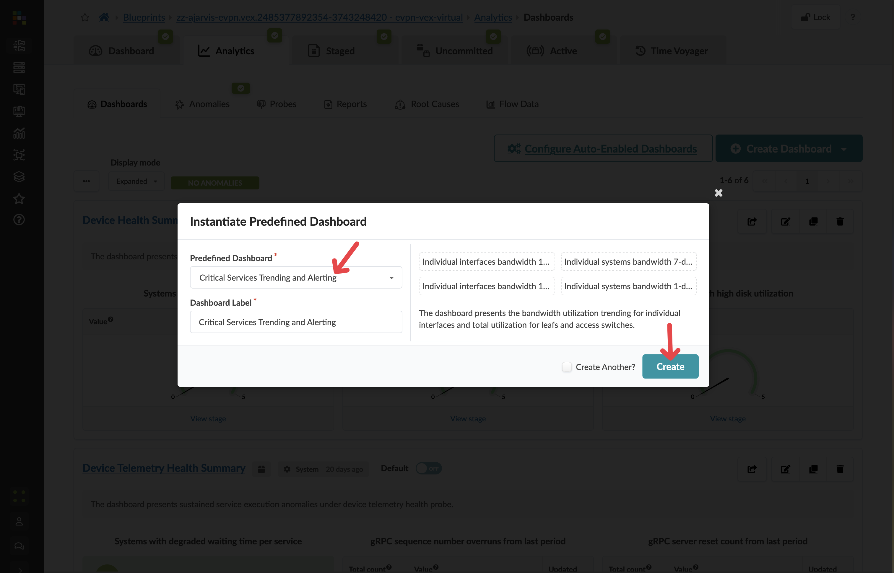
5. The Analytics Dashboard will immediately begin collecting data and monitoring interface utilisation across your fabric

   

## Understanding Analytics Dashboard Operations

When you create a Analytics Dashboard, several things happen:

1. Apstra automatically identifies all the relevant components in your fabric that the Analytics Dashboard should monitor
2. The system begins collecting telemetry data from these components
3. The data is continuously evaluated against the thresholds you've set
4. If any anomalies are detected, an anomaly is created and displayed
5. As your network evolves (adding racks, servers, etc.), the Analytics Dashboard automatically adjusts to monitor the new components - no reconfiguration needed

You can see the data behind the dashboards by clicking on the stage.


This takes you into what we call probes and these probes show how the data is collected, analysed, and alerts are set up which can be fully customised for your own needs.


## Creating Custom Probes and Dashboards

While Apstra comes with a comprehensive set of built-in and predefined probes, its true power lies in the ability to create custom probes and dashboards tailored to your specific needs.

### Custom Telemetry Collection

Apstra allows you to collect and analyse virtually any data available from your network devices:

* **Collectors** - Specify exactly what data to gather from devices
* **Processors** - Define how to process and analyse the collected data
* **Anomaly Detectors** - Set thresholds for when to generate alerts

Examples of custom telemetry you might collect include:

* TCAM resource utilisation 
* MAC address table growth
* Specific QoS queue statistics
* Custom SLA metrics
* Protocol-specific counters
* Memory and CPU utilisation patterns

### Building Custom Dashboards

Once you've created custom probes, you can visualise their data in customised dashboards:

1. Add widgets showing data from your custom probes alongside built-in analytics
2. Organise metrics in ways that are most meaningful for your operations team

### Adaptive Monitoring

The most powerful aspect of Apstra's custom analytics is that they automatically adapt as your environment changes:

1. **Environment Growth**: When you add new racks, devices, or virtual networks, your custom probes automatically extend to monitor these new components

2. **Environment Reduction**: When elements are removed, your analytics automatically adjust without generating false positives

3. **No Explicit Interaction Required**: This adaptation happens without any manual reconfiguration of your monitoring system

### Real-World Applications

Custom probes and dashboards enable countless practical applications:

* **Security Monitoring**: Track anomalous patterns that might indicate security threats
* **Capacity Planning**: Monitor growth trends to anticipate upgrade needs
* **Compliance Verification**: Ensure network configurations meet regulatory requirements
* **Service Level Monitoring**: Track performance against defined SLAs

This unparalleled flexibility ensures that your monitoring system grows and evolves alongside your network, providing continuous visibility without ongoing maintenance overhead. As your network changes, your custom analytics automatically adjust to provide relevant, contextual insights throughout your fabric's lifecycle.

## The Power of Contextual Monitoring

What makes Apstra's monitoring truly powerful is that it's not a separate system - it's integrated with your intent model. This means:

1. **Automatic adaptation**: As your network changes, monitoring adapts automatically
2. **Relevant context**: Anomalies are presented with full context of your design intent
3. **Reduced noise**: You only see alerts for true deviations from intent, not normal operations
4. **Historical comparison**: You can track how metrics evolve over time against your intent

This ensures that your monitoring is always aligned with your current network design and only alerts you to actual issues that require attention.

## What You've Learned

You've now seen how Apstra's Intent-Based Analytics provides:

1. Closed-loop validation that your network matches your design intent
2. Context-aware monitoring that understands your network's purpose
3. Flexible analytics options from built-in to fully customisable
4. Automatic adaptation as your network evolves

This completes our exploration of Day 2 operations in Apstra, from expanding your network to monitoring its health. You've seen how Apstra transforms complex networking tasks into simple, intent-driven operations that save time and reduce risk.

## Scenario: Rolling Back Changes with Confidence

As a final exploration of Apstra's powerful Day 2 capabilities, let's examine one of its most valuable features: **Time Voyager**. This feature allows you to roll back your entire fabric to a previous known-good state with just a few clicks.

Throughout this lab, you've made several commits to your blueprint as you've built out the Analytics service. Each of these commits represents a snapshot of your network's intended state at that point in time. Time Voyager gives you the ability to travel back to any of these snapshots.

## Understanding Time Voyager

Time Voyager is much more than a simple configuration backup and restore tool:

> **TIP**  
> **What makes Time Voyager different?**
>
> Traditional backup/restore:
>
> * Works on individual devices
> * Requires manually tracking which backup goes with which change
> * Often requires scripting to implement rollbacks across multiple devices
> * Can't easily show you the differences between current and previous states
>
> Apstra's Time Voyager:
>
> * Treats your entire fabric as a single system
> * Automatically creates snapshots with each commit
> * Lets you preview the exact changes that would be made by a rollback
> * Handles rolling back configuration across all affected devices
> * Maintains the integrity of your intent model

Time Voyager reflects Apstra's understanding that your network is a system doing a job, not just a collection of individual devices.

## Task: Explore and Use Time Voyager

Let's see how Time Voyager works in practice by exploring our commit history and previewing a rollback:

### Step 1: Access Time Voyager

1. From your blueprint, locate the **Time Voyager** tab on the far right-hand side of the screen
2. Click on **Time Voyager** to open the commit history view
3. You'll see a list of all commits that have been made to this blueprint, with the most recent at the top

   

   > **NOTE**  
   > Each commit is labelled with:
   >
   > * A timestamp
   > * The commit message you entered
   > * The user who made the change

### Step 2: Select a Previous Commit

1. Browse through your commit history to find a point you'd like to explore

   > **TIP**  
   > For this exercise, try selecting the commit from before you added the Analytics service components

2. Click on the commit to select it
3. Click the **Rollback** button

   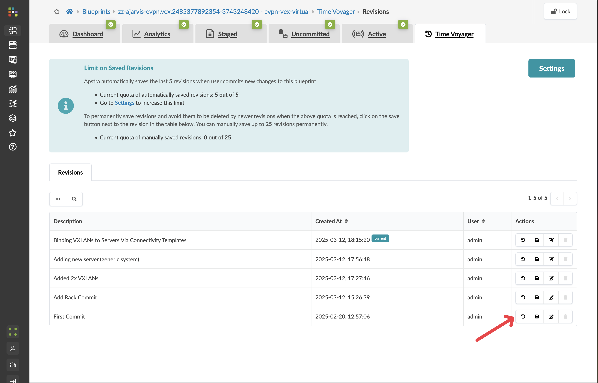
   

   > **NOTE**  
   > This doesn't immediately change your active network! It only loads the previous state into the staging area for your review.

### Step 3: Preview the Rollback Changes

After clicking Rollback, Apstra will load the selected commit into the staging area:

1. Navigate to the **Staged** tab to see what your network looked like at that point in time

   

   > **TIP**  
   > Notice that any components you've added since that commit (like your new rack, routing zone, or virtual networks) are no longer present

2. Click on the **Active** tab to see the topology still in production as the rollback is staged.

   

3. Click the **Uncommitted** tab to see the difference between this previous state and your current active network

   

   > **TIP**  
   > This provides a detailed view of exactly what would change if you proceeded with the rollback
   >
   > Red items show what would be removed
   > Green items show what would be added/restored

4. You can explore these differences in detail to understand the full impact of the rollback

### Step 4: Choose Your Next Action

At this point, you have two options:

1. **Proceed with the rollback**:
   - If you want to actually roll back to this previous state, click **Commit** in the uncommitted tab
   - Apstra will generate and deploy all the necessary configuration changes to return your entire fabric to this previous state
   - All devices in your fabric will be updated as needed to ensure consistency
2. **Cancel the rollback**:
   - If you were just exploring or don't want to proceed with the rollback, click the **Revert** button in the uncommitted tab
   - This will discard the staged changes and return you to your current active state
   - No changes will be made to your network

   

## The Power of Fabric-Wide Rollbacks

What you've just experienced demonstrates the true power of intent-based networking and automation:

* **System-level rollback**: Instead of rolling back device by device, you're rolling back your entire fabric as a system
* **Intent preservation**: The rollback maintains the integrity of your intent model
* **Comprehensive changes**: Apstra automatically determines all the configuration changes needed across all devices
* **Predictable outcome**: You can preview exactly what will change before committing
* **Confidence**: Know that your fabric will return to a known-good state

This capability is invaluable for:

* Recovering from failed changes or misconfigurations
* Temporarily reverting for troubleshooting
* Comparing different network states
* Training and exploration without risk

## What You've Learned

In this Test Drive, you've explored Apstra's powerful capabilities across the network lifecycle:

1. **Design**: Modelling your network with rack types and templates
2. **Deploy**: Implementing physical and logical changes to your fabric
3. **Operate**: Monitoring network health with intent-based analytics
4. **Evolve**: Safely making and rolling back changes using Time Voyager

You've seen how Apstra's intent-based approach transforms complex networking tasks into simple, predictable operations that reduce risk and save time.

Thank you for participating in this Apstra Test Drive! We hope you've gained valuable insights into how Apstra can revolutionise your data centre operations.

## Configuration Deviation Detection

### Understanding Configuration Anomalies

One of Apstra's most powerful capabilities is its ability to detect when a network device's configuration has deviated from the intended state. This is crucial for maintaining the integrity of your network and ensuring that unauthorized or accidental changes don't go unnoticed.

In this exercise, we'll simulate a configuration change outside of Apstra's control and observe how the system detects and alerts you to this deviation.

### Scenario: Detecting Unauthorized Configuration Changes

Imagine that a network engineer has made a direct change to one of your switches without going through Apstra. This could be an emergency fix, an unauthorized change, or simply a mistake. Let's see how Apstra handles this situation.

### Task: Observe Configuration Deviation Detection

#### Step 1: Simulate a Configuration Change

1. Go to your CloudLabs portal, and toggle the **Insert a Configuration Change** slider

   The slider will turn green and you will see a confirmation message:

   

   *Behind the scenes, this simulates a configuration change being made directly on one of your spine switches.*

#### Step 2: Observe the Anomaly Detection

1. Return to the Apstra UI and wait a moment

   *Apstra continuously validates the actual configuration of managed devices against its intended state model.*

2. Soon, a configuration deviation anomaly will appear. Notice the red indicators that highlight where issues have been detected

   

   *These indicators show Apstra's ability to detect discrepancies between its intent model and the actual network state.*

#### Step 3: Investigate the Anomaly

1. Click the **Anomalies** tab to move to the **Anomaly Details** view

   

   *This view provides a centralized list of all detected anomalies across your fabric.*

2. Click **spine2** to go to the telemetry view for the affected device

   

   *This view shows all anomalies detected for this specific device.*

3. Click the **Config** tab to see the anomaly's details. Scroll down to see the configuration deviation

   

   

   *Apstra shows you exactly what has changed, comparing the expected configuration with the actual configuration on the device.*

#### Step 4: Resolve the Configuration Deviation

In a real environment, you would have two options when you discover a configuration deviation:

1. **Accept the Change**: If the change was intentional and should be incorporated into your intent model, you can click the **Accept Changes** button to update Apstra's model.

2. **Revert the Change**: If the change was unauthorized or incorrect, you can click the **Apply Full Config** button to push the correct configuration back to the device.

For this exercise:

1. Return to the CloudLabs portal and toggle off the **Insert a Configuration Change** slider

   *This simulates correcting the unauthorized change.*

2. Return to the Apstra UI and observe that the anomaly is cleared automatically

### Why This Matters

This capability demonstrates several key benefits of Apstra's intent-based approach:

1. **Continuous Validation**: Apstra constantly compares actual device configurations with the intended state
2. **Immediate Detection**: Changes made outside of Apstra are quickly identified
3. **Precise Reporting**: The exact configuration discrepancy is highlighted
4. **Remediation Options**: You can either incorporate or revert changes as appropriate

In a traditional network, unauthorized configuration changes might go undetected until they cause problems. With Apstra, these deviations are immediately flagged, allowing you to maintain the integrity of your network design and prevent potential issues before they impact services.

## Direct CLI Access for Troubleshooting

While Apstra provides comprehensive visibility through its UI, sometimes you need to execute specific CLI commands on a device for deeper troubleshooting or verification. Apstra makes this simple by providing direct CLI access to managed devices right from the interface.

### Accessing the CLI Command Interface

1. Navigate to **Staged > Physical > Topology**

2. Click on the device you want to troubleshoot (in this case, select a leaf switch)
   
3. In the device details panel on the right side, locate the **Device Info** section

4. Find and click the **_Execute CLI Command** option

   

   *This option gives you direct CLI access to the selected device without having to establish a separate connection.*

### Using the Context-Aware CLI

The CLI interface in Apstra has several powerful features that make troubleshooting more efficient:

1. The CLI is context-aware for Junos devices, providing auto-completion of commands

   *This means you can start typing a command and press Tab to see available options, just like on the native Junos CLI.*

2. You can execute any show commands to verify device state, for example:

   ```junos
   show interfaces brief
   show bgp summary
   show route table
   show evpn instance
   ```

3. Output is displayed directly in the Apstra UI, allowing you to quickly analyze results
   

### Benefits of Integrated CLI Access

This integrated CLI access provides several advantages:

* **Efficiency**: No need to establish separate SSH sessions to devices
* **Context**: You're already looking at the device in Apstra, so you have full context of its role and configuration
* **Authentication**: No need to manage separate credentials for CLI access
* **History**: Command history is maintained during your session

### When to Use Direct CLI Access

While Apstra's UI provides most of the information you need, direct CLI access is valuable for:

* Verifying specific protocol states in detail
* Checking counters or statistics not surfaced in the UI
* Validating that configuration changes have taken effect
* Troubleshooting transient issues
* Gathering additional diagnostic information

This capability bridges the gap between Apstra's intent-based management and traditional CLI-based troubleshooting, giving you the best of both worlds when diagnosing network issues.

## What You've Learned

In this troubleshooting section, you've seen how Apstra:

* Continuously validates actual device configurations against intended state
* Immediately detects and alerts on configuration deviations
* Provides detailed information about what changed
* Offers options to either accept or revert changes
* Gives direct CLI access to devices for deeper troubleshooting
* Provides context-aware CLI with auto-completion for efficient command execution

These powerful troubleshooting capabilities ensure that you can quickly identify and resolve issues in your network, whether they're related to configuration deviations or require deeper investigation at the CLI level.
