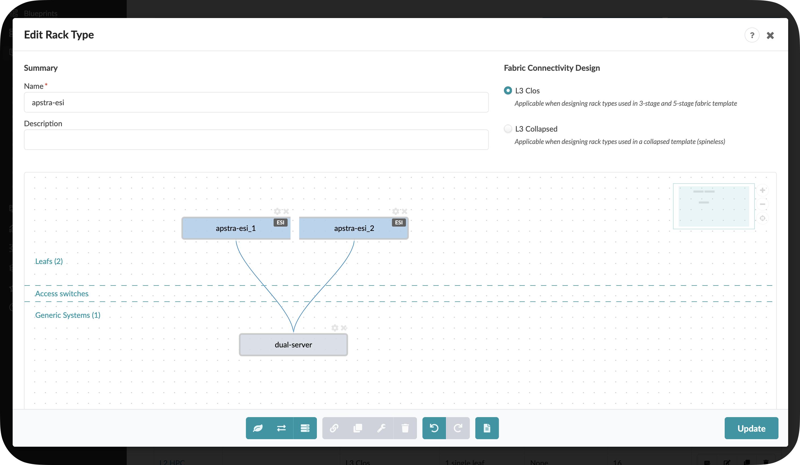

# Apstra Test Drive

## Hands-on with Juniper Networks' Data Centre Automation Solution

## Welcome to Your Apstra Test Drive!

Thank you for joining us for this hands-on experience with Juniper Apstra, the industry's only Intent-Based Networking solution for data centre operations. Over the next two hours, you'll get direct experience with how Apstra can transform your data centre operations - from initial design to ongoing management and optimisation.

## What is Apstra?

Apstra is a powerful intent-based networking solution that enables you to design, build, deploy, and operate your data centre network with confidence and agility. Unlike traditional data centre network management approaches, Apstra provides:

* **Intent-Based Architecture**: Define what you want your network to do, not how to do it
* **Single Source of Truth**: One unified view of your entire network state
* **Closed-Loop Validation**: Continuous verification that your network meets your intent
* **Multi-Vendor Support**: Freedom to choose the best hardware for your needs
* **Automation Throughout the Lifecycle**: From design to deployment to operation

## What You'll Learn Today

This Test Drive is designed to give you practical experience with Apstra's key capabilities in a realistic data centre environment. We've divided the session into two main sections:

### Part 1: Design & Blueprint (30 minutes)

Learn how Apstra lets you model your entire data centre in software before deploying any physical equipment:

* Understanding logical devices, interface maps, and device profiles
* Creating rack types to model your physical infrastructure
* Building templates to define your network architecture
* Deploying a blueprint and assigning resources

### Part 2: Day 2 Operations (90 minutes)

Experience how Apstra simplifies ongoing management of your data centre network:

* Exploring the dashboard and understanding fabric health
* Scaling your data centre by adding new racks
* Extending connectivity with new virtual networks
* Adding and connecting new servers to your fabric
* Setting up external BGP peerings
* Using Time Voyager to roll back configuration changes
* Leveraging analytics to monitor and troubleshoot your network
* Creating custom analytics probes for your specific needs

## Getting Started

Your lab environment is already configured and waiting for you. All the necessary components are accessible through the CloudLabs portal you've logged into.

Let's begin by exploring how Apstra allows you to design your data centre network completely in software, before you ever connect a single cable!

---

## How Apstra Manages Devices

As you progress through the lab, you'll work with abstractions that represent common network constructs. This Intent-Based Networking approach uses these abstractions to build your design, giving Apstra the power to reliably deploy and modify complex infrastructures with speed and precision.

For this Test Drive, we've pre-configured the Logical Devices and Interface Maps to streamline the experience, but you'll become familiar with how these components work together in the upcoming exercises.

**Ready to start? Let's dive in!**

> **TIP**  
> If this is your first time using the CloudLabs environment, navigate to Home Page and view the *Getting Started* instructions.

---

Before we begin building our network, it's essential to understand the foundational elements that make Apstra's intent-based approach possible. These building blocks enable a revolutionary approach to network design -- the ability to model your entire data centre network in software before deploying any physical hardware.

## How Apstra Models Network Hardware

The diagram below illustrates the three key components Apstra uses to model network devices:

Let's explore each of these components and how they work together to create Apstra's powerful abstraction layer:

## Logical Devices

**What they are:** Complete abstractions that define the capabilities of a network device, independent of any physical hardware. They specify:

* Number of ports
* Port speeds
* Breakout capabilities

**Key insight:** A single Logical Device can represent switches from multiple vendors. For example, a "48x10G + 6x100G" Logical Device could represent similar switches from Juniper, Cisco, Arista, or any other vendor. Most vendors offer switches with nearly identical port configurations, making this abstraction extremely powerful.

Think of Logical Devices as the **functional blueprint** of what a switch can do, completely separated from the details of who manufactured it or how it's physically constructed.

## Device Profiles

**What they are:** Pre-defined, thoroughly tested representations of specific hardware platforms that are shipped with Apstra.

**What they contain:**

* Technical specifications for each supported physical or virtual device
* Vendor-specific details needed to configure and monitor the device
* Software compatibility information

Device Profiles are created and maintained by Apstra engineering, ensuring that each supported platform works seamlessly with the system. They contain all the vendor-specific knowledge that Apstra needs to properly manage each physical device.

Think of Device Profiles as the **vendor-specific knowledge base** that allows Apstra to properly manage different hardware platforms.

## Interface Maps

**What they are:** The critical "glue" that connects abstract Logical Devices to physical hardware when you're ready to deploy.

**How they work:**

* Map the abstract ports defined in a Logical Device to the actual physical interfaces on a specific switch
* Enable the transition from design (software) to deployment (hardware)
* Activated when you add a device to a blueprint and commit configuration

Think of Interface Maps as the **translation layer** that connects your abstract design to the physical reality of your data centre.

## Why This Abstraction Is Revolutionary

This abstraction layer is the foundational principle that enables Apstra's most powerful capabilities:

1. **Design Without Hardware:** Model your entire data centre network in software without owning a single physical switch
2. **True Multi-Vendor Support:** Mix and match hardware from different vendors in the same blueprint
3. **Vendor Independence:** Change hardware vendors without changing your network design
4. **Future-Proofing:** Swap in new hardware generations while maintaining the same logical design
5. **Focus on Intent:** Design based on what you need your network to do, not vendor-specific implementation details

The beauty of this approach is that you can design your entire network based on capabilities and intent, then decide which specific hardware to deploy later. You can even change vendors for different parts of your network, or replace hardware with a different vendor's equipment later, all while maintaining the same logical design.

For this Test Drive, these components have been pre-configured for you to save time. As you continue to explore Apstra, you'll gain a deeper appreciation for how this abstraction layer simplifies network design, deployment, and management.

**Now that we understand these foundational elements, let's move on to creating Rack Types that will form the physical structure of our data centre design.**

Rack Types are modular definitions that represent the physical structure of your data centre racks, including:

* Top-of-rack switches
* Servers and workloads
* Connections between devices
* Redundancy settings

Think of Rack Types as the building blocks you'll use to assemble your complete data centre design. By creating reusable Rack Types, you can quickly scale your network design by adding new instances of the same rack configuration.

In this exercise, we'll create two common rack configurations:

1. A single-switch rack (single leaf)
2. A dual-switch rack with redundant connectivity (dual leaf)

## Exercise 1: Create Single Leaf Rack Type

Let's create a simple rack with a single top-of-rack switch and one connected server:

1. Navigate to Design > Rack Types and click **Create in Designer**

   

2. In the **Summary** section, configure:

   | Summary | Value |
   |---------|-------|
   | Name | *your_name*-single |
   | Fabric connectivity design | L3 Clos |

3. Add a leaf switch by clicking the leaf icon in the bottom menu. With the node selected, click the wrench icon to configure:

   | Leafs | Values |
   |-------|--------|
   | Name | *your_name*-single |
   | Logical Device | slicer-7x10-1 |
   | Links per spine | 1 |

   

4. Add a server by clicking the **Add Generic** icon in the menu. After it appears, configure it with the wrench icon:

   | Server | Values |
   |--------|--------|
   | Name | single-server |
   | Logical Device | AOS-1x10-1 |

   

5. Connect the devices by:
   - Click and drag to select both the switch and server
   - Click the chain icon to create a link between them
   - Set Count to 1
   - Click Create

   

6. In the next view, you can optionally modify the link label, then click Create

   

7. Your completed rack should look like this:

   

## Exercise 2: Create Dual-Homed Rack Type

Now let's create a more complex rack with redundant switches for high availability:

1. From Design > Rack Types, click **Create in Designer**
2. Configure the rack summary:

   | Summary | Value |
   |---------|-------|
   | Name | *your_name*-esi |
   | Fabric connectivity design | L3 Clos |

3. Add a leaf node and configure it:

   | Leafs | Value |
   |-------|-------|
   | Label | *your_name*-esi |
   | Logical Device | slicer-7x10-1 |
   | Links per spine | 1 |
   | Redundancy Protocol | esi |

   

   *Notice how selecting "esi" automatically adds a second leaf switch to your design!*

4. Add a dual-connected server:

   | Parameter | Values |
   |-----------|--------|
   | Label | dual-server |
   | Logical Device | AOS-2x10-1 |

   

5. Create connections by selecting both leaf switches and the server, then:
   - Ensure both "First" and "Second" peer switches are checked
   - Click Create

   

6. In the next screen, set LAG Mode to "LACP Active" and click Create

   

7. Your completed dual-switch rack should look like this:

   

Congratulations! You've created two rack types that can be used as building blocks for your data centre fabric design. In the next section, we'll use these rack types to create a complete network template.

> **TIP**  
> **Pro Tip:** Rack Types are extremely flexible - you can design them to match exactly how your physical racks are configured, with different server types, connection patterns, and redundancy options. For large data centres, well-designed Rack Types dramatically simplify the network design process.

---

Templates are where we bring together the rack types we've built and define how they connect to form a complete data centre fabric. Think of templates as the architectural blueprint for your network design.

A template allows you to:

* Specify how many of each rack type you'll deploy
* Define spine switches to connect your racks
* Configure global networking policies
* Set the foundation for routing and switching protocols

Let's create a template that uses both rack types we built in the previous exercise.

## Exercise: Create a Fabric Template

1. Navigate to Design > Templates and click **Create Template**

   

2. In the **Common Parameters** section, configure:

   | Common Parameters | Value |
   |------------------|-------|
   | Name | __your_name___fabric |
   | Type | RACK BASED |

3. In the **Policies** section, configure:

   | Policies | Value |
   |----------|-------|
   | ASN Allocation Scheme (spine) | Unique |
   | Overlay Control Protocol | MP-EBGP EVPN |

   These settings define:
   - How ASNs (Autonomous System Numbers) will be assigned to spine switches
   - That MP-EBGP EVPN will be used as the overlay protocol for virtual networks

4. In the **Structure** section, build your fabric topology:

   | Structure | Value |
   |-----------|-------|
   | Rack Types | *your_name*-esi (1x10 Gbps links to spines) |
   | Number of Racks | 1 |
   | Click **Add racks** |  |
   | Rack Types | *your_name*-single (1x10 Gbps links to spines) |
   | Number of Racks | 1 |
   | Spine Logical Device | slicer-7x10-1 |
   | (Spine) Count | 2 |
   | Links per Superspine Count | *leave as is* |
   | Link to Superspine Speed | *leave as is* |

   As you add these elements, notice how the topology preview on the right updates to visualise your fabric design.

5. Click **Create** to generate your template.
6. To view the details of your template, click its name in the template list. Check the **Show Links?** box to see the connections between devices.

   

   This diagram shows:
   - Your dual-leaf rack (ESI) and single-leaf rack
   - Two spine switches
   - All interconnections between leafs and spines
   - Device roles within the fabric

## Understanding Your Template

Let's take a moment to understand what you've created:

* A **2-tier Clos fabric** (spine-leaf architecture)
* Two **spine switches** providing redundant connections between all leafs
* One **dual-switch rack** with ESI (Ethernet Segment Identifier) for high availability
* One **single-switch rack** for lower-cost deployment
* **MP-EBGP EVPN** as the overlay protocol for network virtualisation

This design provides:

* **High availability** through redundant paths
* **Scalability** - you can add more racks without redesigning the network
* **Flexibility** - different rack types for different needs
* **Standardisation** - consistent configuration across all devices

## Next Steps

You've now created a complete software model of your network design! In the next exercise, we'll instantiate this template as a blueprint - which is a deployable instance of your design - and assign resources to make it ready for deployment.

> **TIP**  
> **Pro Tip:** Templates are reusable - you can create multiple blueprints from the same template. This makes it easy to deploy consistent network designs across multiple environments or data centres.

---

A Blueprint is a deployable instance of your template. While a template is the general design for your network, a blueprint is the specific implementation that will be deployed to your actual devices.

In this exercise, we'll:

1. Create a blueprint from the template we just built
2. Assign all necessary network resources (ASNs and IP pools)
3. Save our work with our first blueprint commit

## Exercise 1: Create a Blueprint

1. Click **Blueprints**, then click **Create Blueprint**

   

2. Configure your blueprint:

   | Field | Value |
   |-------|-------|
   | Name | *your_name*-pod1 |
   | Template | __your_name___fabric |

3. A preview of the blueprint's intent will appear. Review it and click **Create**
4. For a moment, you'll see Apstra "scaffolding" the blueprint - creating all the necessary components from your template
5. Once complete, click the blueprint name to see its dashboard

   

## Exercise 2: Assign Resources

You'll notice red indicators showing where resource assignments are needed. These are places where specific values (like IP addresses or ASNs) need to be assigned before the blueprint can be deployed. Let's assign all the necessary resources to our blueprint.

> **NOTE**: The specific pools we're using in this exercise are pre-configured examples. In your production environment, you can use any non-overlapping address ranges. Apstra will always validate that no IP address or ASN overlaps exist in the fabric.

### Assign ASN Resources

1. From the blueprint, navigate to Staged > Physical > Build > Resources

   

2. Click the red status indicator next to **ASNs - Spines**, then click **Update assignments**

3. Select the **Private-64512-65534** pool from the dropdown
4. Click **Save**. The red status indicator should turn green, indicating a successful assignment.
   
5. Repeat the same process for **ASNs - Leafs**, also selecting the **Private-64512-65534** pool.

### Assign IP Address Resources

Now let's assign IP addressing for device loopbacks and fabric links:

1. While still in the **Resources** tab, click the red status indicator next to **Loopback IPs - Spines**
2. Click **Update assignments** and select the **Private-192.168.0.0/16** pool
   
3. Click **Save** to apply the assignment
4. Repeat for **Loopback IPs - Leafs**, also selecting the **Private-192.168.0.0/16** pool
5. Next, click the red status indicator next to **Link IPs - Spines<>Leafs**
6. Click **Update assignments** and select the **Private-172.16.0.0/12** pool
7. Click **Save** to apply the assignment
8. Verify that all resource indicators have turned green, indicating successful assignments

> **TIP**  
> **Pro Tip:** Apstra automatically manages the allocation of addresses from these pools, ensuring there are no conflicts or overlaps. The system keeps track of all allocations and maintains the single source of truth for your network.

### Assign Interface Maps and Perform Our First Commit

This is where we're now telling Apstra what the underlying device will be, and this will enable it to take all of that intent and generate configuration for the switches you'll actually be using.

1. To the right of the **Resources** tab, select the **Device Profiles** tab.

   
2. Click the red status indicator next to **virtual-7x10-1**, then click the **Change interface maps assignment** button.
3. Select interface maps for each device as shown in the table below.

   **Table Interface Map Assignment Values**

   | Name | Interface Map |
   |------|--------------|
   | evpn_esi_001_leaf1 | Juniper_vEX__slicer-7x10-1 |
   | evpn_esi_001_leaf2 | Juniper_vEX__slicer-7x10-1 |
   | evpn_single_001_leaf1 | Juniper_vEX__slicer-7x10-1 |
   | spine1 | Juniper_vEX__slicer-7x10-1 |
   | spine2 | Juniper_vEX__slicer-7x10-1 |

4. Click **Update Assignments** to assign the device models and return to the build page. After a moment the red status indicator turns green indicating that the assignment was successful.

## Exercise 3: Review the Rendered Configuration

Before you do your first commit on your blueprint, let's examine how Apstra has automated the complete configuration of your devices:

1. Navigate to **Staged > Physical > Topology**

2. Select one of your leaf switches by clicking on it

3. Click on the **Rendered Configuration** tab

   

4. Scroll through the complete configuration that Apstra has generated automatically:

   > **NOTE**  
   > **Take a moment to appreciate what you're seeing here:**
   >
   > - A complete, ready-to-deploy device configuration
   > - All interface configurations with correct IP addressing
   > - BGP underlay configuration with proper ASNs and neighbours
   > - EVPN overlay configuration
   > - All VRF and routing configurations
   > - System settings and management access
   >
   > All of this was generated automatically based on your intent!

5. Notice that you didn't have to write a single line of this configuration. Apstra translated your high-level intent (rack types, templates, resource assignments) into detailed, vendor-specific configuration.

6. If you're familiar with network configuration, you'll recognise that creating this configuration manually would take hours per device and be prone to errors.

This demonstrates the power of Apstra's intent-based approach. You define what you want your network to do, and Apstra handles all the complex, device-specific implementation details. When your physical devices are connected, this configuration will be pushed to them automatically.

> **TIP**  
> **Pro Tip:** For multi-vendor environments, Apstra generates the appropriate vendor-specific configuration for each device type while maintaining consistent network behaviour. This means you can focus on your design intent rather than worrying about the syntax differences between vendors.

## Exercise 4: Commit Your Blueprint Changes

Now, let's save all our work with a commit. This records the current state of the blueprint and prepares it for eventual deployment.

1. Click the **Uncommitted** tab to see all staged changes

   This view shows the logical difference in the blueprint state since the last commit. Since this is our first commit, it shows everything we've added.

   You can see even more details by clicking the **Full Nodes Diff** tab.

2. After reviewing, click the **Commit** button in the upper right

3. Enter a description for this commit, such as "Initial blueprint creation with resource assignments"

   

   *Note: Descriptive commit messages are important for tracking changes, especially when using the Time Voyager feature to move between fabric snapshots.*

4. Click **Commit** to save your changes

## What You've Accomplished

Congratulations! You've now:

1. Created a complete software model of your network design using rack types and templates
2. Instantiated that design as a deployable blueprint
3. Assigned all necessary resources:
   - ASNs for spine and leaf switches from Private-64512-65534
   - Loopback IP addresses from Private-192.168.0.0/16
   - Fabric link IP addresses from Private-172.16.0.0/12
4. Made your first blueprint commit to record your work

In a full deployment scenario, you would continue by assigning interface mappings and system IDs, then deploy the blueprint to your physical devices. For this Test Drive, we'll now switch to an already-deployed blueprint to explore Day 2 operations.

## Understanding Resource Assignment

You've just experienced one of Apstra's key capabilities: automated resource management. Here's why this matters:

* **Eliminate IP conflicts:** Apstra ensures no overlapping IP addresses are assigned
* **Simplify planning:** No need to maintain complex spreadsheets for IP address management
* **Single source of truth:** All resource assignments are tracked and visible in one place
* **Automation:** Resources are automatically assigned to new devices as you scale

While we've used specific pools in this exercise, Apstra works with any valid addressing scheme. You can create your own pools with addressing that makes sense for your environment, and Apstra will ensure they're used correctly.

## Transition to Day 2 Operations

For the next section of our Test Drive, we'll be using a pre-configured blueprint called "SE Demo" that represents a fully deployed data centre fabric. This will allow us to focus on the operational aspects of Apstra without going through the complete deployment process.

Let's take a break here, and when we return, we'll switch to the SE Demo blueprint to explore Apstra's powerful Day 2 operational capabilities.

Now that we've explored how Apstra enables you to design and deploy a network, let's dive into where Apstra truly shines: ongoing operations and management of your data centre fabric.

For this section, we'll use a pre-configured blueprint called "SE Demo" that represents a fully operational data centre. This allows us to focus on the operational capabilities without completing the full deployment process.

## Switching to the SE Demo/SE Flow Blueprint

1. Return to the Apstra main menu and navigate to **Blueprints**
2. Find and select the **SE Demo** or the **SE Flow** blueprint depending on what has been deployed for you
3. You'll now see the dashboard for this running network

## Understanding the Dashboard

The dashboard gives you an immediate view of your network's health and status. Let's explore what we're seeing:

Key components of the dashboard include:

* **Health Status**: Overall fabric health at a glance
* **Anomalies**: Any issues that require attention
* **Fabric Devices**: Status of all switches in the fabric
* **Uncommitted Changes**: Work that has been staged but not yet committed
* **Recent Activity**: History of changes and events

Take a moment to explore the dashboard. Notice that everything is green, indicating a healthy network with no current issues.

## What We'll Cover Next

Over the next 90 minutes, we'll explore how Apstra makes day-to-day network operations dramatically simpler and more reliable. We'll cover:

1. **Scaling your network**:
   - Adding a new rack to expand capacity
   - Adding new virtual networks
   - Connecting new servers
2. **Network Connectivity**:
   - Setting up external BGP peering
   - Managing routing and switching configurations
3. **Network Management**:
   - Using Time Voyager to roll back changes
   - Troubleshooting and resolving issues
4. **Analytics and Visibility**:
   - Exploring built-in analytics
   - Creating custom analytics probes
   - Understanding how analytics stay in lockstep with your network intent

Let's begin by exploring how to expand your operational data centre without disrupting existing services!

**Scenario: Expanding Your Data Centre for a New Big Data Analytics Service**

*Your company has decided to launch a new revenue-generating Big Data Analytics service for customers. This initiative requires expanding your data centre infrastructure to support:*

1. *Additional compute capacity (new rack with servers)*
2. *Network segmentation for the new service (new routing zone/VRF)*
3. *Multiple application tiers for the analytics platform (web front-end and database back-end)*
4. *External connectivity for customer access*

*As the network operations team, you need to implement these changes quickly and reliably. Fortunately, your data centre runs on Apstra, making these operations straightforward and risk-free.*

*Let's jump in!*

## Scenario: Adding Capacity for the Big Data Analytics Service

Your company has just greenlit a new Big Data Analytics service offering for customers. The first task is to expand the physical capacity of your data centre by adding a new rack of switches and servers to support the increased compute requirements.

## Task: Add a New Rack to Your Data Centre

> **TIP**  
> **Reflection Point:** Before we begin, take a moment to consider what this would involve in a traditional data centre:
>
> * How would you provision a new pair of switches from scratch?
> * How would you ensure consistency with existing network configurations?
> * How long would it take to:
>   * Plan IP addressing and ASN assignments
>   * Configure basic switch setup (management, credentials)
>   * Configure underlay protocols (BGP)
>   * Configure overlay protocols (EVPN, VXLAN)
>   * Test connectivity
>   * Troubleshoot issues
>
> Many organisations report this process taking days or even weeks for a single rack addition when done manually.

With Apstra, we'll accomplish this in just a few minutes. Let's begin!

### Step 1: Navigate to the SE Demo Blueprint

1. From the Apstra main menu, select **Blueprints**
2. Click on the **SE Demo** blueprint to open it

### Step 2: Add a New Rack to the Blueprint

The easiest and fastest way to expand your network is to add a rack:

1. Navigate to Staged > Staged > Physical > Racks
2. Click the **Add Racks** button (+)

   

3. From the **Rack Type** drop-down list, select ***your_name*-esi** (the dual-switch redundant rack with ESI that you designed in Part 1)
4. Leave the number of racks at **1**
5. Click **Add** to stage the rack addition and return to the topology view

   

   > **TIP**  
   > **Key Insight:** At this point, you've just prestaged a rack addition without needing any physical hardware. Apstra allows you to plan and prepare your network expansion before the physical switches even arrive in your data centre.

### Step 3: Let Apstra Handle Resource Allocation

When you add a new rack, you will need to add new IPs and ASNs. Apstra does this for you, taking the next items from your resource pools.

*You don't need to do a thing, it does it for you*

### Step 4: Assign Device Profiles

1. Navigate to Staged > Staged > Physical > Device Profiles

   
2. If there are any red indicators for your new leaf switches, click them, then click **Change interface maps assignment**

   
3. Select **Juniper_vEX__slicer-7x10-1** as the interface map for your new leaf switches, you were telling Apstra what the underlying devices will be.
4. Click **Update Assignments**

### Step 5: Review and Commit Your Changes

1. Click the **Uncommitted** tab to see all your staged changes

   > **TIP**  
   > Take a moment to review what Apstra is preparing for you. Notice how the system has automatically:
   >
   > * Created a plan for assigning unique ASNs to the new devices
   > * Prepared IP addressing for all interfaces
   > * Set up BGP peering configurations between the new leaf switches and existing spine switches
   > * Prepared EVPN configurations for the overlay network

2. After reviewing, enter a commit message like "Prestaged new analytics rack" and click **Commit**. Make sure to give it a meaningful description.

   

### Step 6: Understanding the Power of Prestaging

What makes this workflow revolutionary is that:

1. **No physical devices needed yet:** You've prestaged the entire configuration before the physical switches even arrive at your data centre
2. **Instant deployment when hardware arrives:** When the physical switches do arrive, you simply:
   - Rack and cable the switches according to your design
   - Add the devices to Apstra's management
   - Map them to the prestaged leaf switches in your blueprint
   - The full configuration will be pushed to them in seconds
3. **Zero-touch integration:** The new switches will be fully deployed, configured, and monitored as part of your fabric immediately
4. **Network-wide consistency:** All existing devices that need to communicate with these new switches will be automatically updated to include them in the fabric

### Step 7: Examine the Prepared Configuration

Let's look at what Apstra has prepared:

1. Navigate to Staged > Staged > Physical > Topology
2. Find one of your newly added leaf switches and click on it

   
3. Click on the **Rendered Configuration** tab
4. Review the complete configuration that Apstra has generated. Notice:
   - Basic system configuration
   - Interface configurations
   - BGP underlay configuration
   - EVPN overlay configuration
   - All IP addressing

   

   > **TIP**  
   > This entire configuration was generated automatically because Apstra understands your network as a complete system. When the physical devices are added, this configuration will be deployed to them, and the system will also automatically update configurations on the spine switches to establish BGP sessions with these new devices.

## What You've Accomplished

In just a few minutes, you've:

1. Prestaged a new rack with redundant leaf switches to your data centre
2. Created a plan for all necessary resources (ASNs, IP addresses)
3. Generated complete device configurations that will be ready when the hardware arrives
4. Prepared updates for
